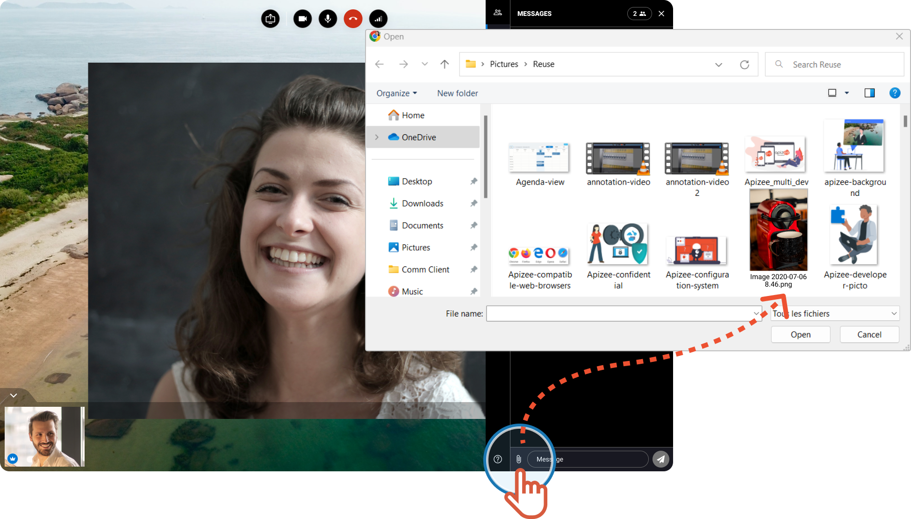
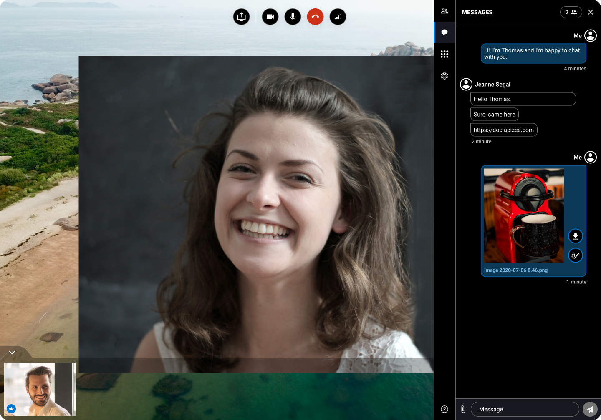

# share-file

## Share files:

* [During the session](share-file.md)
* [After the session in the portal](share-file.md)

### During the session

1. On the right, clique the **Messages**tab 
2.  At the bottom, next to the message field, click the **paper clip** button 

    |   | The file explorer opens on your screen. |
    | - | --------------------------------------- |

 3. Choose a file and click **Open**.

```
|  | When the file is uploaded, it displays in the **Messages**. |
| --- | --- |
```




The participants will be able to download the file by clicking If you are the organizer of the session, you can open a picture in whiteboard to annotate or draw on it by clicking 


##

### After the session in the portal


You are the organizer of the session from which the files are from. Or, you are an administrator. You are logged in to your account.


1. In the left-hand menu, click the service you want.
2.  In the list, find the session you want and click&#x20;

    |   | The page displays. |
    | - | ------------------ |
3. Under **Shared files**, choose the files and click **Share**.
4.  Click **Send**.

    |   | The persons to whom you shared the files receive a message with a new download link. |
    | - | ------------------------------------------------------------------------------------ |
