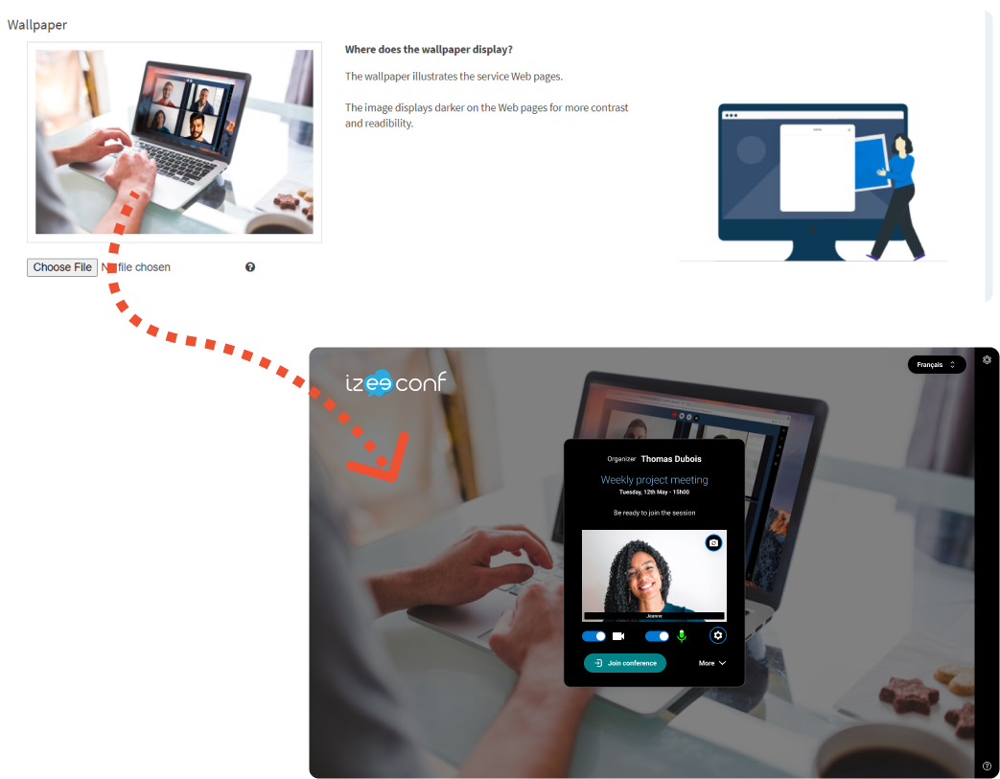
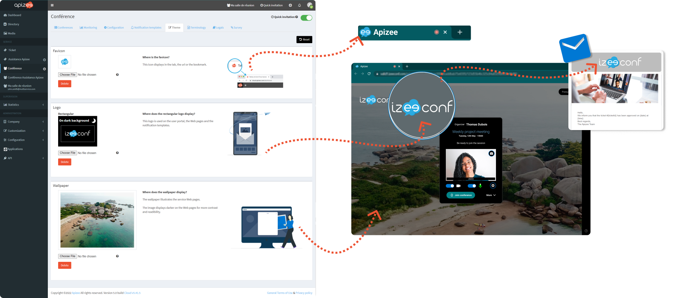

# customize-interface

You can customize and adapt the interface to your corporate graphic charter.

The theme that is displayed by default is the [company](customize-interface.md) one.

However, you can customize the theme of one or several[services](customize-interface.md) if you need them to be different.

## Customize the Company graphic theme

1. In the left-hand menu, click **Customization**then, click **Graphic theme**.

&#x20;2\. Click **Choose File**to change the : \* Favicon This icon displays in the tab, the url or the bookmark.  \* Rectangular logo This logo is used on the user portal, the Web pages and the notification templates.

&#x20;\* Square logo This logo is used on the user portal when the menu is minimized.

It is the logo of your company information page as well.

&#x20;\* Wallpaper The wallpaper fills the application background.

 3. Click **Save**.


These changes are applied to all the services of your company.


## Customize the Service theme

You want to customize one service in particular ? You do not want to use the company theme by default :

1. Click the service name on the left-hand menu.
2. Click the **Theme**tab.
3.  Click **Create a new theme**.&#x20;

    \|  | If you create a new theme, it will not be synchronized with the default theme anymore. You can [come back to the default theme](customize-interface.md#Reset-to-default-theme)at any moment. | | --- | --- |
4. Click **Choose File**to change the:

* Favicon The file must be:
  * PNG
  * 5 Mb max.
  * 40 x 40 pixels min.
* Rectangular logo The file must be:
  * PNG
  * 5 Mb max.
  * 210 x 80 pixels min.
* Wallpaper The file must be:
  * JPG
  * 5 Mb max.
  * 1024 x 680 pixels min.


The new files are saved as soon as they are downloaded.


1. Click **Delete** to remove the image you uploaded and come back to the image used in the default theme.


If you changed your mind and want to come back to the [Company default theme](customize-interface.md), click **Reset** .

