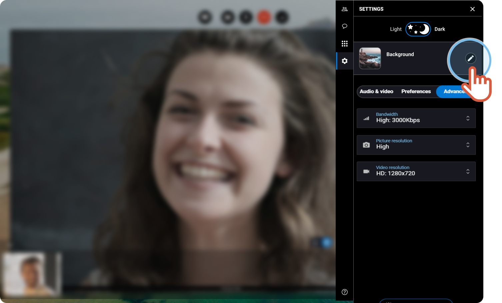
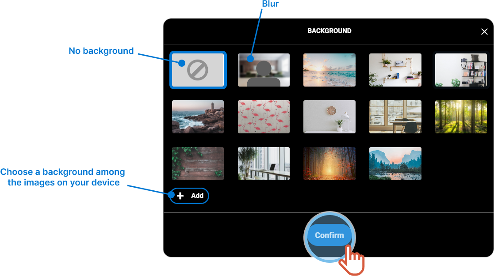
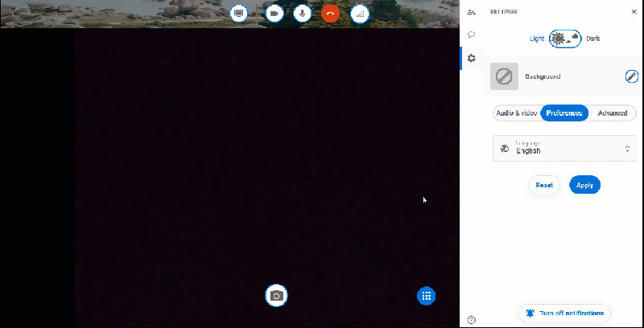

# change-the-virtual-background

1. On the right, click the **Settings** tab.
2. Click to change the background.

 3. Choose a background or a blurred effect. 4. If you want to customize and upload a new background, click **Add**. 5. Choose an image and click **Open**. 6. Click **Confirm**.


The background or the blurred effect displays.


