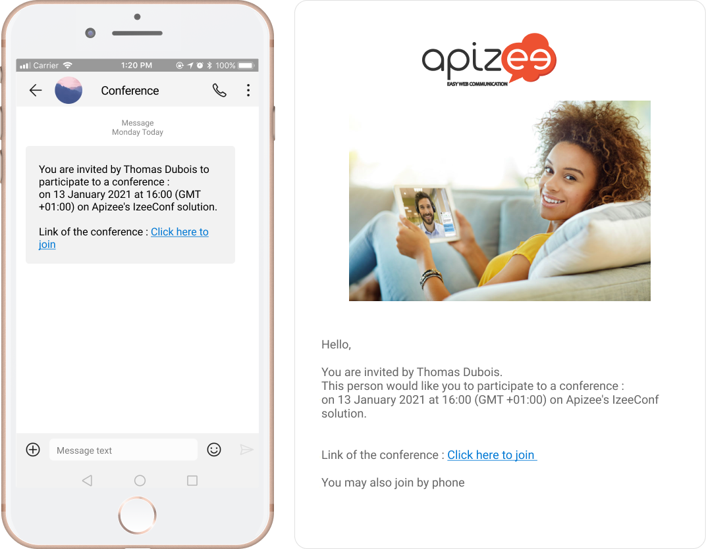
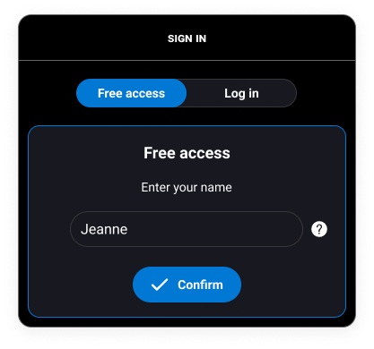
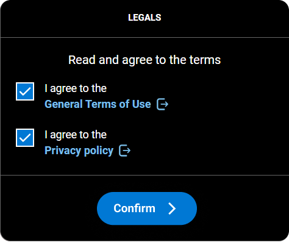
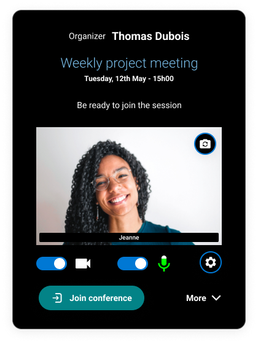
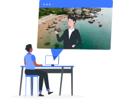
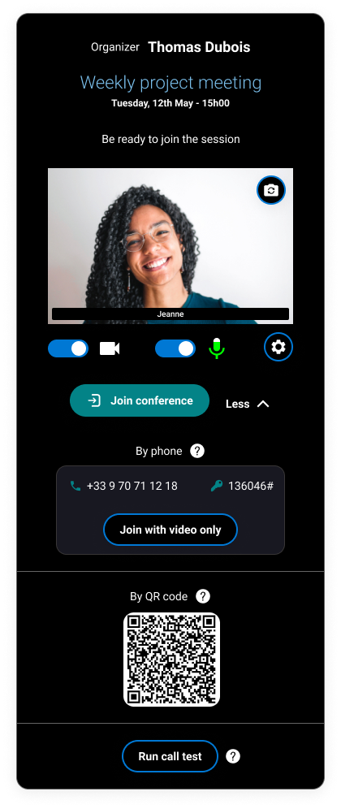
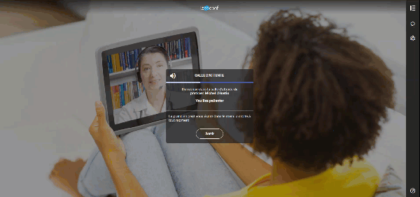
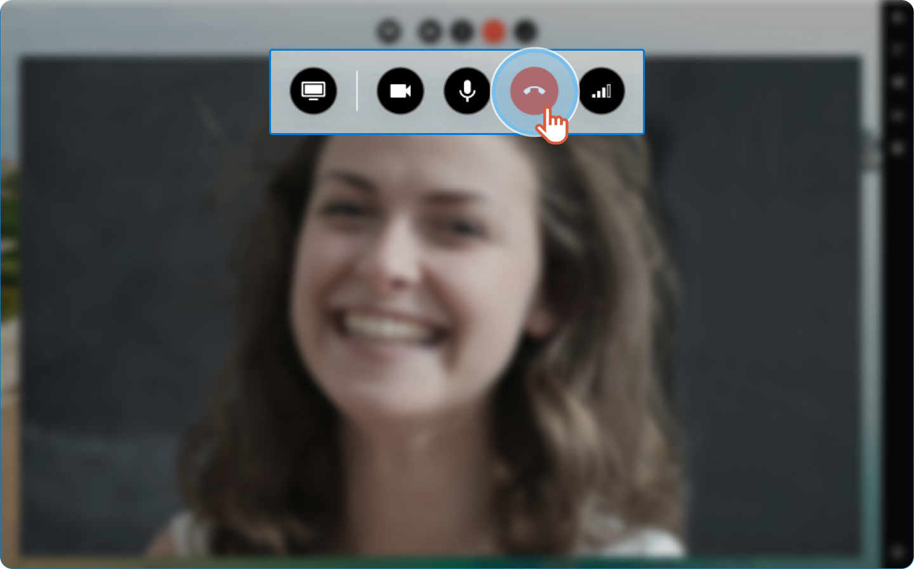

# join-and-leave-assistance-as-guest

## Join the session


You received a text message or an email with a link to join the session.


1. Click the **link**in the message.



1. Enter your name then, click **Confirm**.



```
|  | If you have an Apizee account, click **Log in**. |
| --- | --- |
```

2\. Tick the boxes to agree to the terms then, click **Confirm**.

 3. **Allow**your web browser to use the microphone and the camera. If you do not allow, the participants will not hear you and see you.

.png>) 4. Get ready, check your microphone and camera then, click **Join conference**. If you want it, you can turn off the microphone and the camera before joining the session. You can turn them on again later.



**Want to change your background?**

|   | **See also** [Change the virtual background](https://github.com/rvailleux/docs/tree/master/faq/video-assistance-multi/video-assistance-multi/agents/configure-my-assistance-settings/change-the-virtual-background.md) |
| - | ---------------------------------------------------------------------------------------------------------------------------------------------------------------------------------------------------------------------- |

\[+] [Show More](https://github.com/rvailleux/docs/tree/master/faq/video-assistance-multi/admins/javascript:void\(0\)/README.md) \[-] [Hide](https://github.com/rvailleux/docs/tree/master/faq/video-assistance-multi/admins/javascript:void\(0\)/README.md) |  | If you want to join the conference with a phone or by QR code, click **More**.\
Here are the different options: | | --- | --- |




You are in the waiting room.


Wait for the organizer to allow you to enter into the session.

The organizer has been informed and he/she can send you messages to keep you informed. | | --- | --- |




The communication starts.


## Leave the session

When the appointment is over, click 


