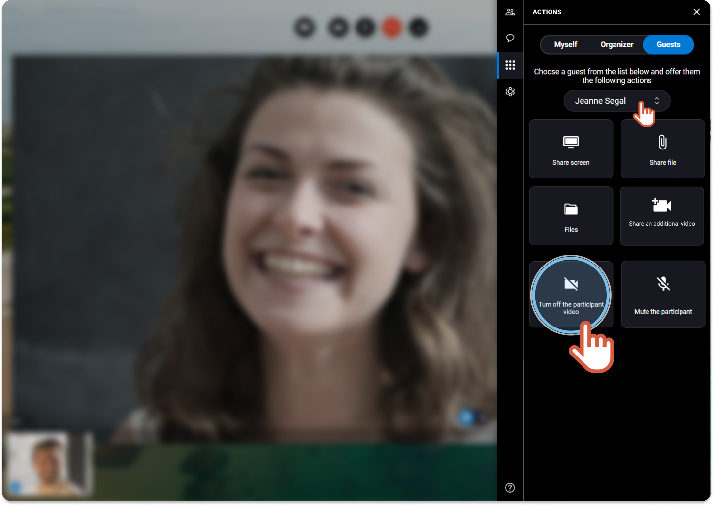

# hide-a-participant-video-organizer


You are the organizer of the session and you want to turn off the video of participant, but just for you.


1. On the right, click the **Actions** tab 
2. Click the **Guests** tab.

 3. If you are more than 2 participants, choose the name of the participant in the drop-down menu. 4. Click **Turn off the participant video**.



```
|  | The participant video is cut just for the organizer. The other participants still see that person. |
| --- | --- |
```

5\. Click the button again to activate the participant video.
