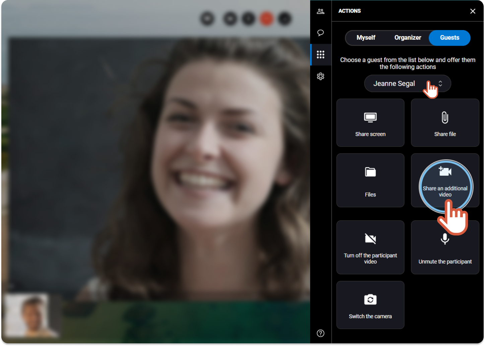
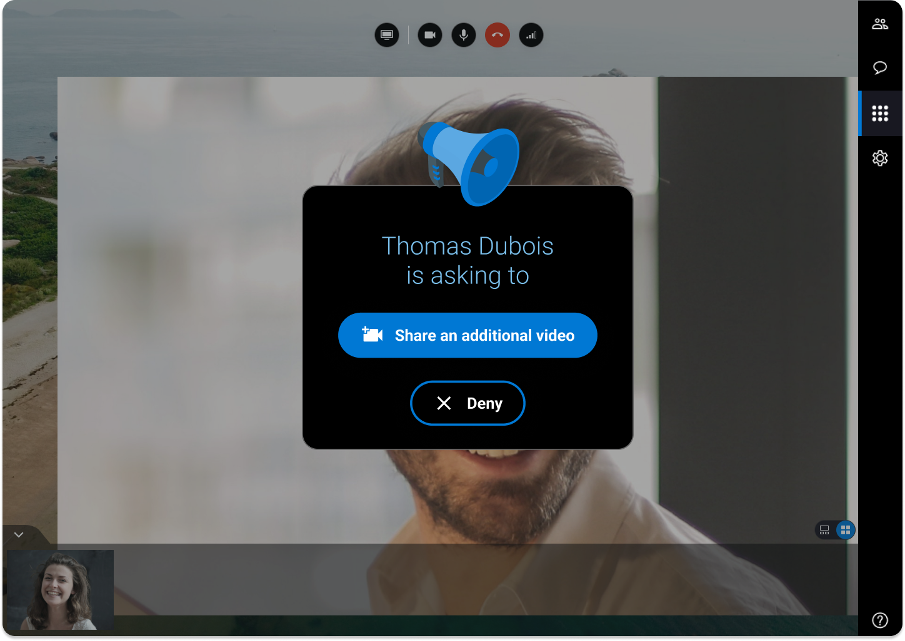

# remote-assist-share-additional-camera

|   | Available only if the participant has **several cameras** on his device. |
| - | ------------------------------------------------------------------------ |


You are the organizer of the session and you want to help a participant to share another camera in addition to the one that is already used.


1. On the right, click the **Actions** tab 
2. Click the **Guests** tab.

 3. If you are more than 2 participants, choose the name of the participant in the drop-down menu. 4. Click **Share an additional video**.



```
|  | An invitation is sent to the participant and displays on his screen as follow: |
| --- | --- |
```

**Guest screen** 

```
|  | When accepted, a new video displays on the screen in addition to the one that was already displayed. |
| --- | --- |
```
