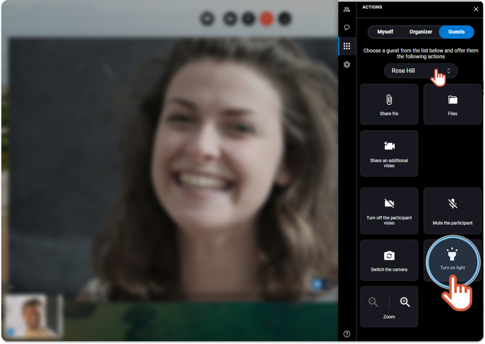
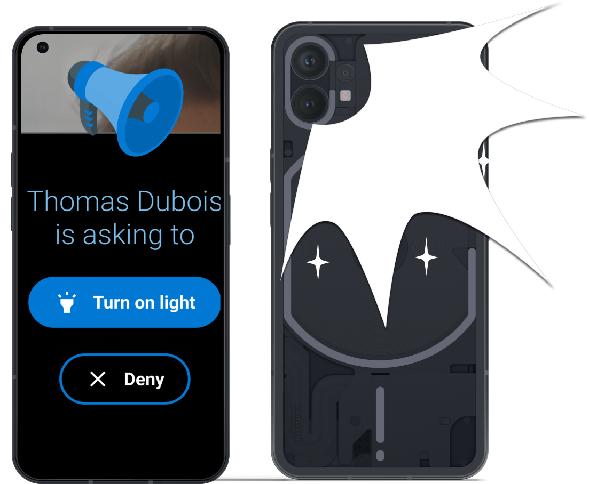

# remote-assist-turn-on-participant-phone-light

\|  | Available only if the participant is following the session with:

* an **Android smartphone**. - the **back camera** selected. | | --- | --- |


You are the organizer of the session and you cannot see clearly what the participant is showing to you. You want to help the participant to turn on the flashlight on the back of his phone.


1. On the right, click the **Actions** tab 
2. Click the **Guests** tab.

 3. If you are more than 2 participants, choose the name of the participant in the drop-down menu. 4. Click **Turn on light**.



```
|  | An invitation is sent to the participant and displays on his screen as follow: |
| --- | --- |
```

**Guest screen** 

```
|  | When accepted, the flashlight of his mobile phone is on. |
| --- | --- |
```
