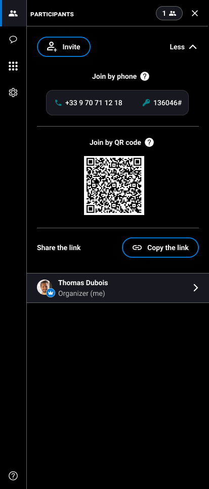

# invite-new-participant-to-join-ongoing-assistance


You are participating to an ongoing session and you want to invite someone to this session.


1. On the right, click the **Participants** tab.
2. Click **Invite**.

 3. Enter the contact of the person you want to invite. 4. Enter a personal **message** and click **Send invitation**.


The invitation is sent. The person to whom you sent an invitation will receive a message with a link to join the session.


You can also invite a person to join the session by phone. Interested? Click **Show more**. \[+] [Show More](https://github.com/rvailleux/docs/tree/master/faq/video-assistance-multi/guests/actions-during-the-assistance/javascript:void\(0\)/README.md) \[-] [Hide](https://github.com/rvailleux/docs/tree/master/faq/video-assistance-multi/guests/actions-during-the-assistance/javascript:void\(0\)/README.md)

1. On the right, in the **Participants** tab, click **More**.

 2. Under **Join by phone**, copy the **phone number** and the **DTMF code**.

 3. Send it to the participant you want to invite.
