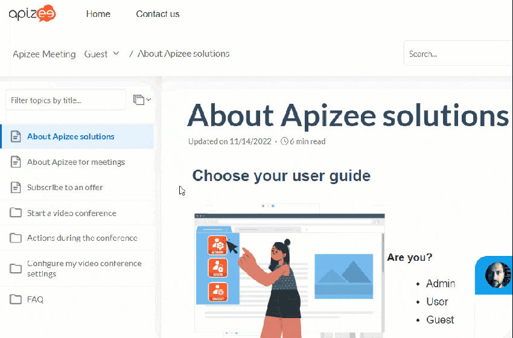
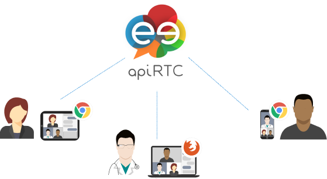

# about-apizee-solutions

## Choose your user guide

**Are you?**

* Admin
* User
* Guest

Choose a user guide according to your profile and check the information relevant to your user role only.

## Check the compatibility

Apizee solutions are "Plug-in free". They are 100% Web-based to ensure communication experience on major Internet browsers and connected devices.

Video communication has never been that easy!

\| No installation needed | The Apizee solutions use the **ApiRTC** architecture which uses the **WebRTC** protocol. This protocol of communication is directly embedded in the latest versions of the Web browsers. This is why you do not need to install anything as long as you have a compatible Web browser.  | | --- | --- | | Compatible devices | The Apizee solutions are compatible with:

* PC, - MacOs, - tablets and - smartphones  | | System configuration | 

|         | **Version**   | **Characteristics**      |
| ------- | ------------- | ------------------------ |
| Windows | 7, 8, 10 & 11 | Intel Core 2 Duo 4GB RAM |

Recommended: I5 quad-core 8GB RAM | | MacOS | From 10.7 to 10.13 | All, since 2011 | | iOS | 8 + | iPhone 5, iPad 1 | | Android | 4.4 + | ARM or x86 Dual-core 3GB RAM

Recommended: octo-core 6GB RAM | | Bandwidth | -- | 300kb/s – 2.4MB/s

Recommended: 4G | | Camera | -- | All

Recommended: 720p/1080p |

\| | Compatible Web browsers | We recommend that you use the following Web browsers for a better experience with our solutions:

\| **OS/Browsers** | **Features** | 

**Chrome** | 

**Firefox** | 

**Opera** | 

**Edge** | 

**Safari** | 

**Samsung** Internet | | --- | --- | --- | --- | --- | --- | --- | --- | | 

Windows | Audio/video | v45+ | v46+ | v35+ | v79+ | | | | Whiteboard |  |  |  |  | | | | Screensharing | \*\* | v52+ |  |  | | | | Conference |  |  |  |  | | | | Remote access

For Windows 7, 8.1, 10 & 11 |  |  N/A for Windows 8.1 | | | | | | 

MacOS | Audio/video | v45+ | v46+ | v35+ | v79+ | v11+ \*\*\* | | | Whiteboard |  |  |  |  |  | | | Screensharing |  \*\* | v52+ |  |  | v13.0.2+ | | | Conference |  |  |  |  |  | | |  | Audio/video | - | - | - | - | iOS11.2+ \*\*\* | | | Whiteboard |  |  |  |  |  | | | Screensharing | - | - | - | - | View \* | | | Conference | - | - | - | - |  | | |  Android | Audio/video | v59+ | v54+ | v40+ | v79+ | | Tested with v7.2.10.33+ | | Whiteboard |  |  |  |  | |  | | Screensharing | View \* | View \* | View \* | View\* | | View\* | | Conference |  |  |  |  | |  | |  Linux | Audio/video | v45+ | v46+ | v35+ | | | | | Whiteboard |  |  |  | | | | | Screensharing |  \*\* | v52+ |  | | | | | Conference |  |  |  | | | |

\* The user can see the screen shared by the other participants but cannot share his own screen. \*\* Screen sharing available with browser extension. \*\*\* Safari 14.0.1 on MacOS and 14.2 on iOS have sound issues. |
