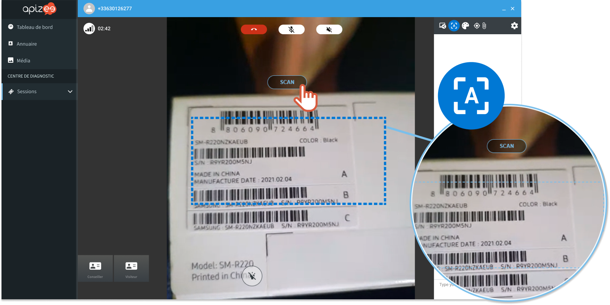
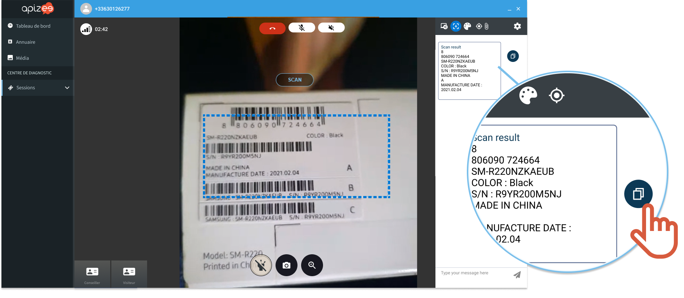

# How to retrieve text information from the guest video?

You are an agent during an ongoing video assistance and you need to retrieve some written information (text, numbers) that the guest is showing to you with the camera.

1. On the right hand-side, click the **\[A]** to activate the scan.

.png>) 2. Ask the guest to center the information to scan inside the blue rectangle. 3. Click **SCAN**.



```
|  | The scan result displays in the **Messages**. |
| --- | --- |
```

4\. Click to copy the content.

 5. Paste it wherever you want.


Double check the scan result before pasting it.

