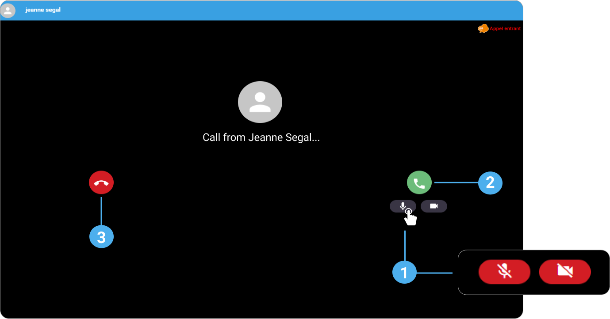

# communicate-colleagues-activate-and-turn-off-the-microphone-and-camera

1. Click the **microphone** and/or the **camera** to deactivate them before you enter the assistance session. You can activate the camera and the microphone during the session, if needed.
2. Click to start the assistance session.
3. Click to hang up the assistance session.

***

**Watch the tutorial**

[More tutorials](../tutorials.md)
