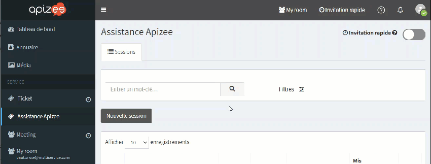
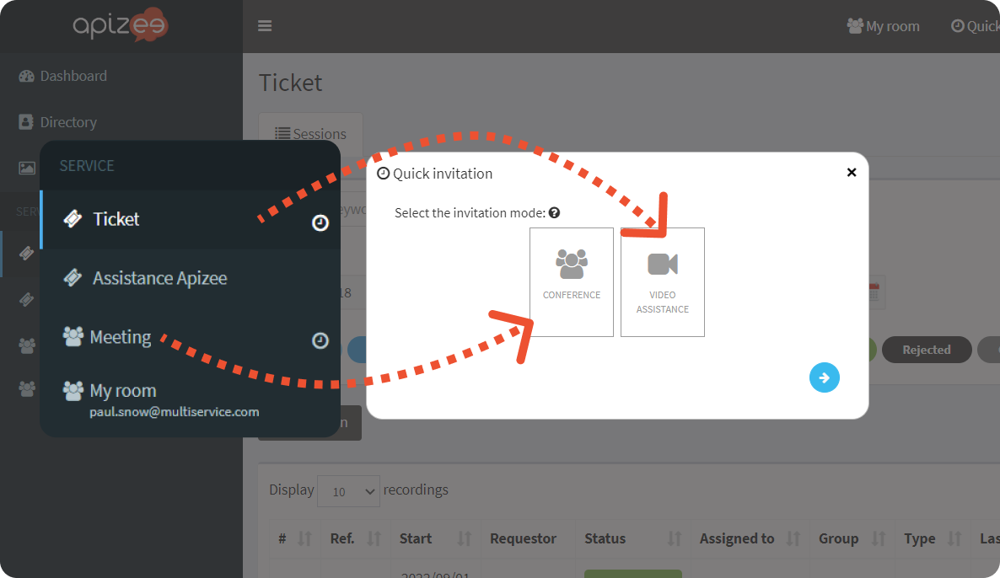

# configure-the-quick-invitation

1. On the left-hand menu, choose the service for which you want to configure the **Quick invitation**.
2. On the top right, click the switch button **Quick invitation**.


The configuration is automatically saved. On the left-hand menu, you can see a clock in front of the service you just configured.



If you have several services in the left-hand menu, note that you can configure the **Quick invitation** for one video conference and one video assistance service only.- the conference services have this pictogram - the video assistance services have this pictogram


| .png>) | **See also** [Send a quick invitation by email and/or SMS](../start-a-video-assistance/create-a-ticket-send-an-invitation/create-a-ticket-quick-invitation-by-email-and-or-sms.md) |
| ------------------------------------------------------------ | ---------------------------------------------------------------------------------------------------------------------------------------------------------------------------------- |
