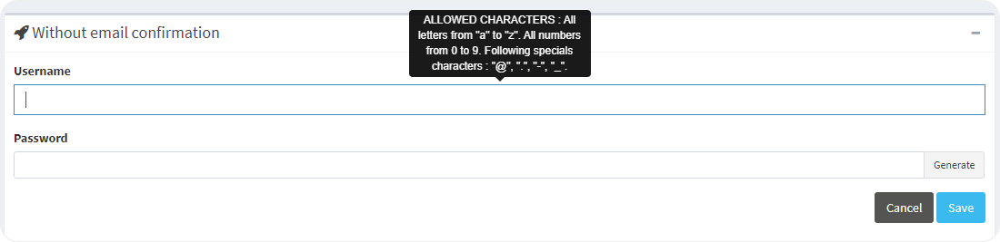

# without-an-email-confirmation

1. Enter a **login** and a **password**.

 2. Write it down and keep it. 3. Click **Save**. 4. Send the login and the password to the new user by the way you want.


The account is created.


| .png>) | **See also** [Log in to the Apizee portal for the first time - login and password](<../../log-in-to-the-apizee-portal-for-the-first-time.md#A login and a password>) |
| --------------------------------------------------------------- | -------------------------------------------------------------------------------------------------------------------------------------------------------------------- |
