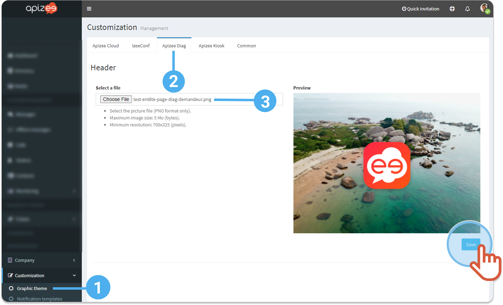

# change-the-assistance-page-header

1. In the left-hand menu, click **Customization** then, **Graphic theme**.
2. Click the **Apizee Diag** tab.
3. Click **Choose File** to change the header of the requester assistance page.


The new picture displays in the header of the requester assistance page.


