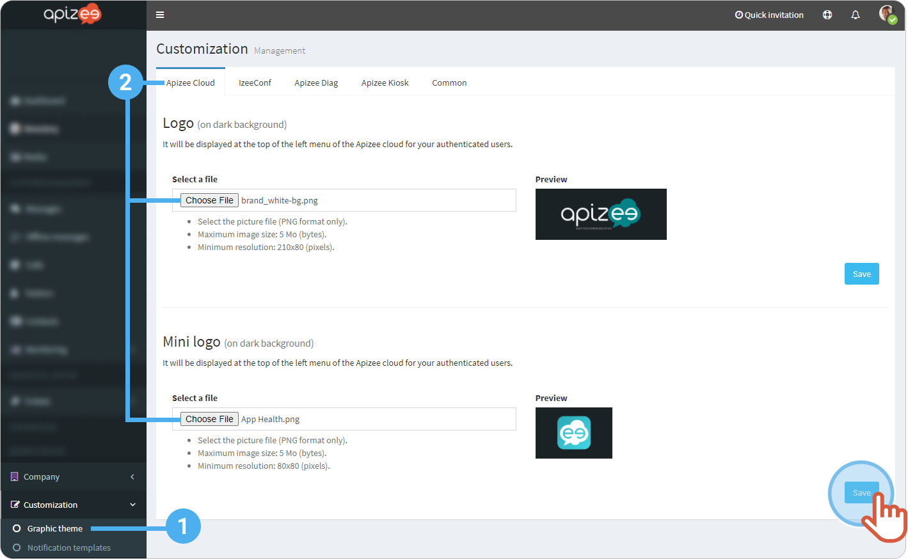
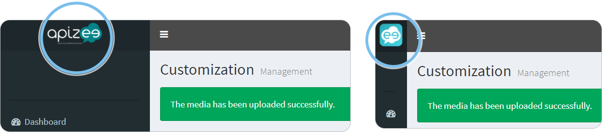

# change-the-logos

1. In the left-hand menu, click **Customization** then, **Graphic theme**.
2. In the **Apizee Cloud** tab, under **Logo** and/or **Mini logo**, click **Choose File** to change the current logo by the one you want.
3. Click **Save**.


The new logos display.



The file has to be a .png and size at least:

* 21&#x30;_&#x38;0 pixels for the logo.- 8&#x30;_&#x38;0 pixels for the mini logo.

