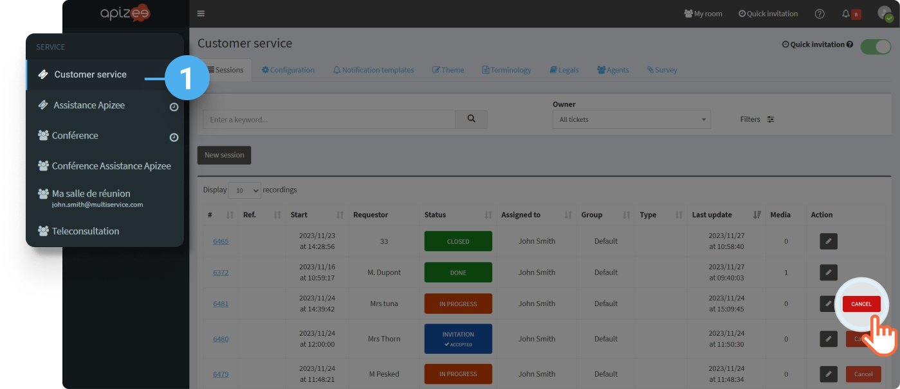
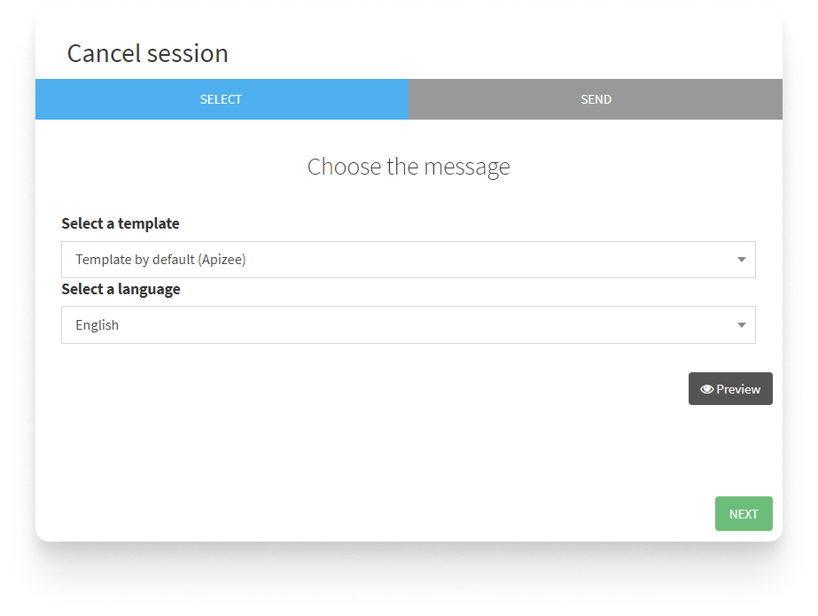
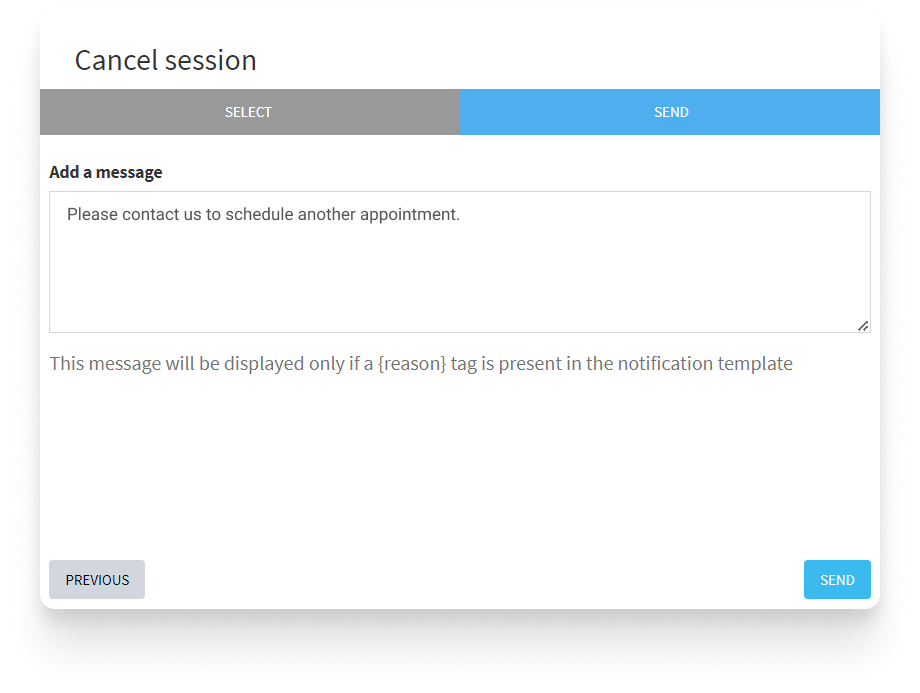
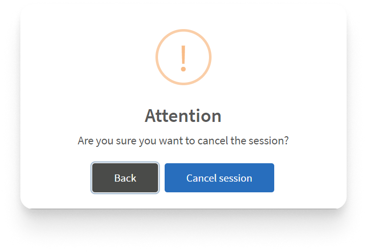

# Need to cancel a scheduled assistance?

1. In the left-hand menu, click the service you want.
2. In the ticket list, find the ticket you want and click **Cancel**.

 3. You are going to advise the guest that was invited to the video assistance:

```
1. Choose the message **template** you want, and choose the **language**.
2. Click **Next**.
```

 3. Add a personnal information that will be added to the message. 4. Click **Send**.  4. A message displays, click **Cancel session**.




The session is canceled and the guest is informed of the situation.



You can also cancel a session from the assistance page.

* Scroll down the page.- Click **Cancel session**.- Follow the same steps as below.



