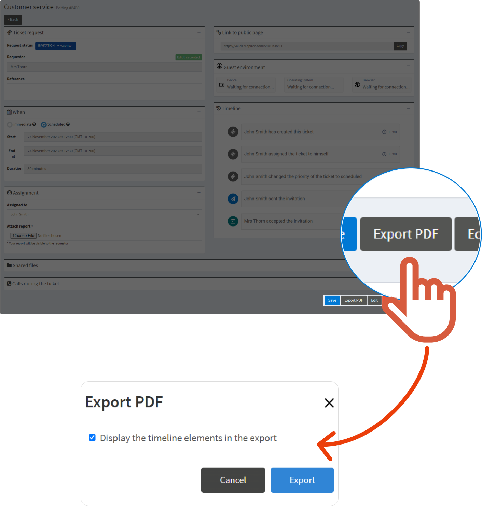
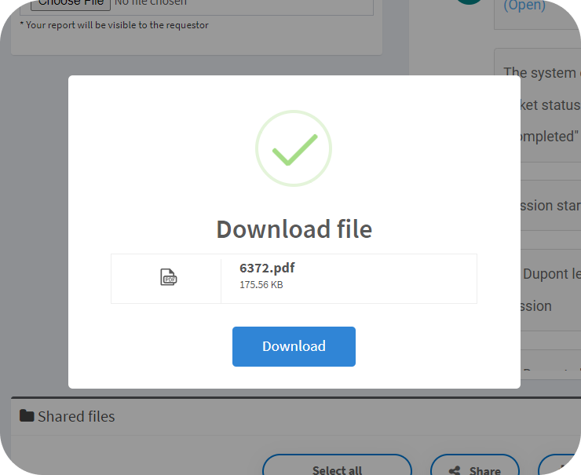
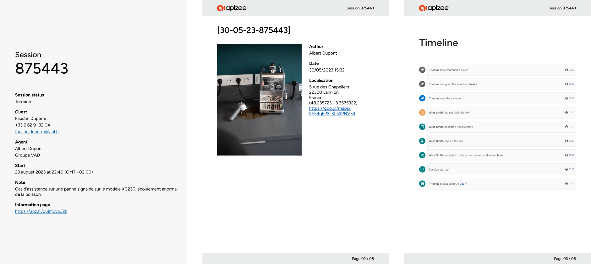

# Need to retrieve the assistance information?

1. In the left-hand menu, click the service you want.
2. In the ticket list, find the ticket you want and click 

 3. Click **Export PDF**. 4. Tick the box if you want to add the **Timeline** elements in the export and click **Export**.

 5. When the export is ready, click **Download**.


The file is downloaded on your device. The PDF file displays and is available in the **Shared files** section.



Need to watch the videos recorded during the assistance? Click the link under **Information page**. The [Information page](follow-a-ticket.md#link-to-information-page) retreives all the assistance details.

Where was the picture taken? If configured, click the [Geolocation](../configuration-on-the-apizee-portal/configure-the-video-assistance/customize-the-tickets.md#config-geoloc) **link** to open the location on Google Maps.

In the **Timeline**, click **Open** to open a picture in a new tab.

