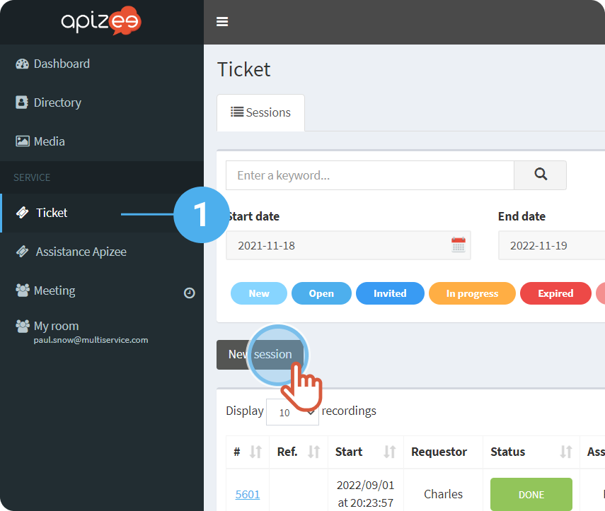
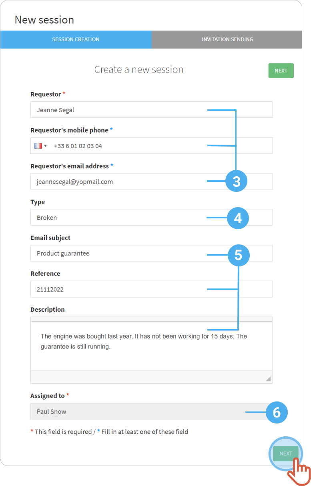
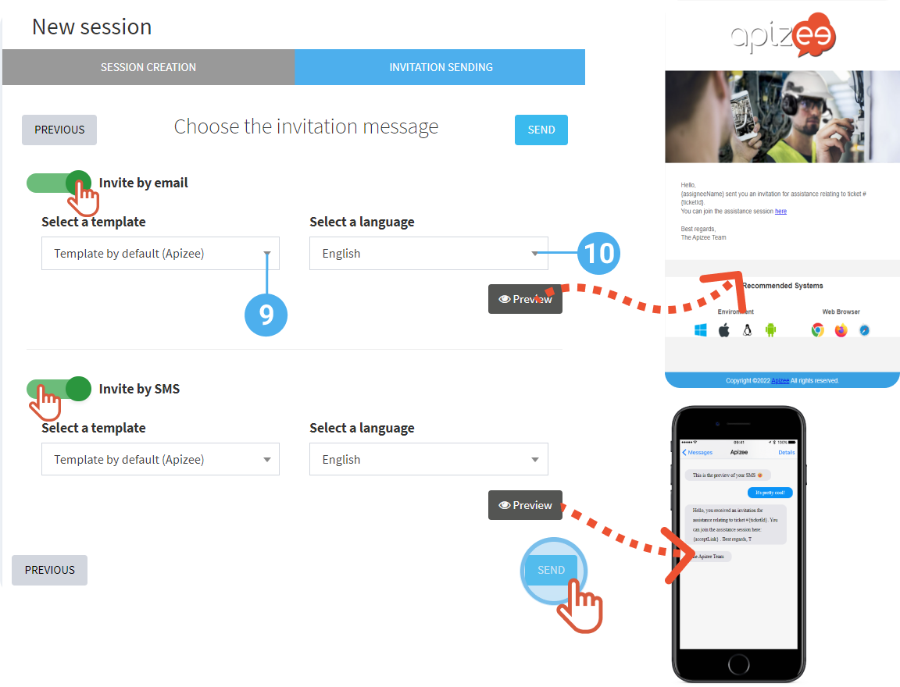

# create-a-ticket-common-invitation

1. In the left-hand menu, click the service you want.

**Ticket**, for example. 2. Click **New session**.

 3. Fill in the requester information: name, **phone number** and/or **email address**. 4. Enter the **type** of request. 5. Enter the **email subject**, the ticket **reference** and add some **notes** about the reason of the request. 6. Click the **Assigned to** drop-down menu to choose the person that will be in charge of the ticket. 7. Click **Next**.



```
|  | The ticket is automatically assigned to the agent that creates it (When a supervisor creates a ticket, the supervisor has to choose who will be in charge of the ticket). |
| --- | --- |
```

8\. If you entered the guest email address and the phone number, choose whether you want to send the invitation by **email** and/or by **SMS**. 9. Choose an invitation **template**. If you did not create a template, choose **Template by default (Apizee)**. 10. Choose a **language**. 11. Click **Send**.




The ticket for a video session is created and an invitation is sent to the requester.


***

**Watch the tutorial**

[More tutorials](../../tutorials.md)
