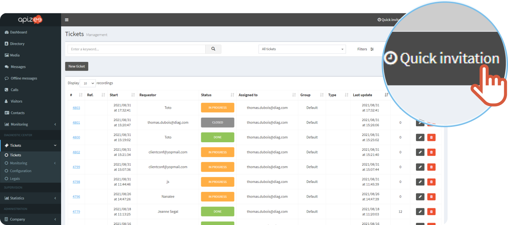
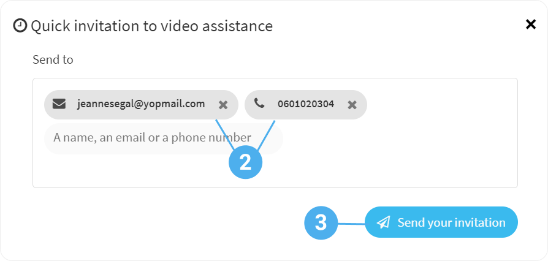

# create-a-ticket-quick-invitation-by-email-and-or-sms

1. In the menu bar, at the top right, click **Quick invitation**.

 2. Enter the email address or the phone number of the person you want to invite. 3. Click **Send your invitation**.


The invitation is sent to the requester.

