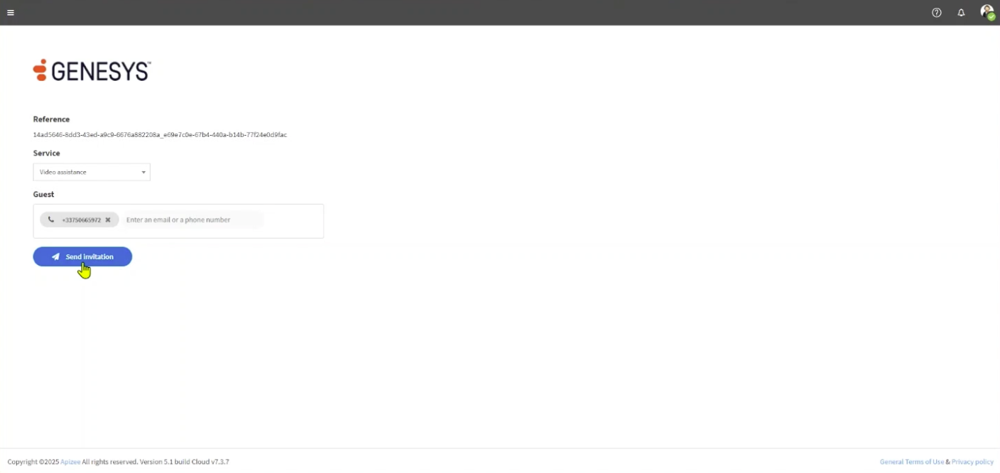
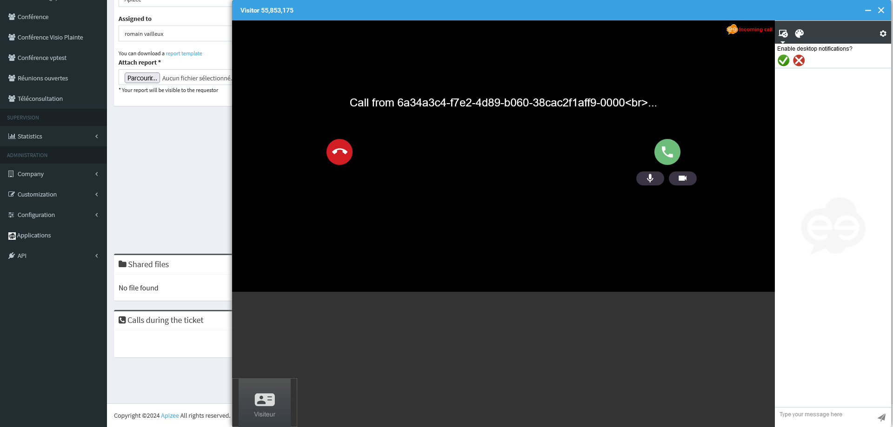

# Getting started with Apizee for Genesys

The Apizee connector is an add-on for Genesys. It helps customer support personnel start video sessions inside Genesys.


*Use this connector to give visual help to the user during support calls.*

**Target Users:** Support agents who use Genesys.
**Main Benefit:** When phone, email, or chat is not enough, video helps solve problems faster.
**Benefits:** Faster resolution, reduced escalation and enhanced tracking.


## Quick Start Guide


Before you start, make sure:

* The Apizee connector is installed.
* You can access Genesys with a user account authorized to use Apizee.
* Your Internet connection is stable.
* Your device has camera and microphone access enabled.


1. **Log in to Genesys.**

   Enter your credentials and access the platform.

2. **Start the video session.**

   When an incoming call is assigned to you, the Apizee widget is available.

   The customer's phone number is automatically filled into the Apizee widget interface.

   Click **Invite**.

   

   
   Note that the phone number field is pre-filled with the Contact's mobile phone number associated with the current call.

   To send an invitation for a video call to a different number, please update the phone number in the side panel or later in the Apizee platform.
   

3. **Log in to the Apizee solution.**

   If you are not already logged in the Apizee solution, fill in your user name and password then click **Sign-In**.

   

   
   The SSO authentication option is compatible with the Apizee for Genesys app.
   

4. **Send invitation.**

   You are now ready to send an invitation to join the video call to your guest: click **Send Invitation**.

   

5. **Allow access to camera and microphone.**

   Accept the prompt in your browser.

   
   *If no prompt appears, check your browser's settings.*
   

6. **The video call begins.**

   In the Apizee solution, you will be automatically redirected to the detail page of the newly created **ticket**.

   Eventually, the guest will click on the link they received via SMS and begin the video call.

   You will then be prompted with a call signal.

   

7. **Assist the user.**

   Discover all the available visual engagement actions accessible through your Genesys platform in the dedicated article:

   ➡️ [Visual engagement actions overview](../video-assistance/help-desk/actions-during-the-video-assistance/actions-overview.md)

8. **After the video call.**

   After the call, the agent can track their interaction with the customer in the details of an interaction, in the "Participant Data" section.

   The information available for each interaction:

   1. The assigned agent
   2. Whether there was an Apizee video call
   3. The URL of the detailed Apizee report for the video call
   4. The duration

   
