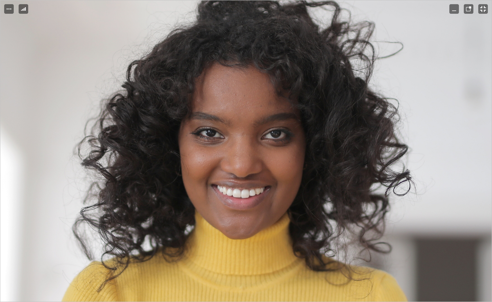
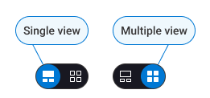
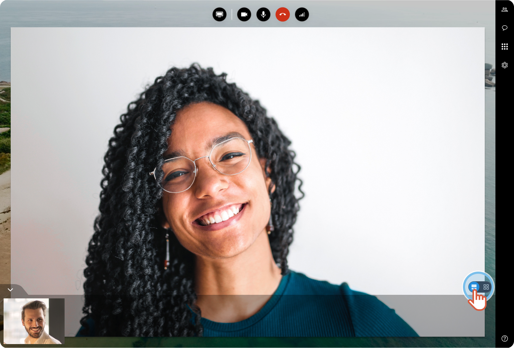
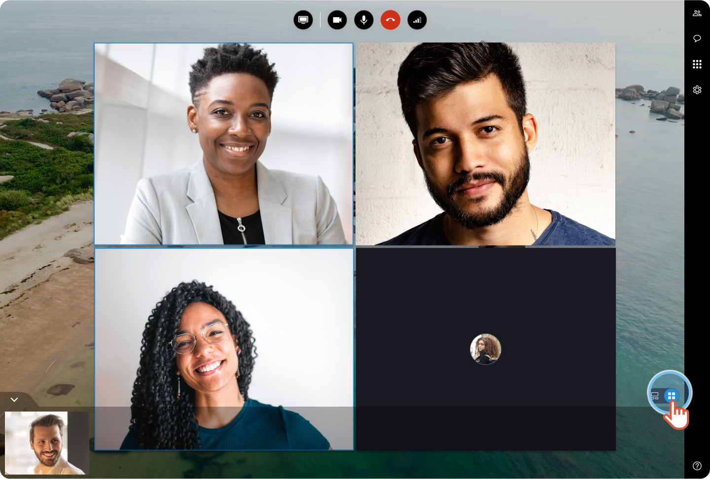
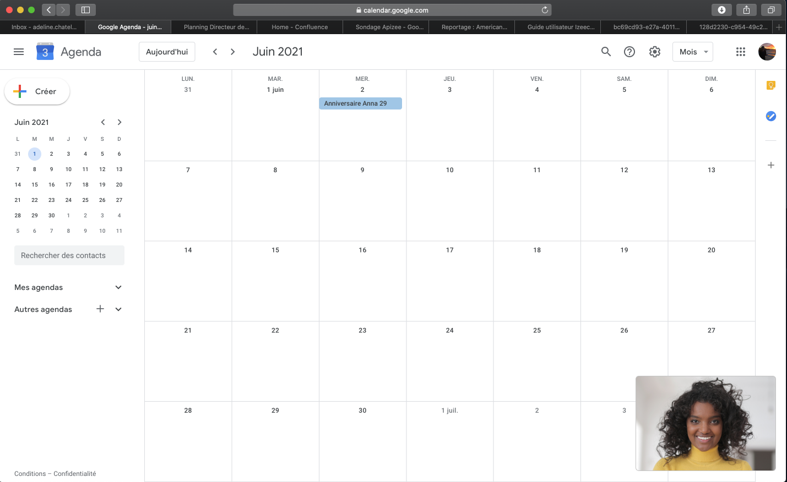

# How to change the way the videos display?

* [Full screen](choose-the-screen-display-mode.md)
* [Single view / Multiple view](choose-the-screen-display-mode.md)
* [Picture in picture](choose-the-screen-display-mode.md)

##  Full screen

Switch to full screen to concentrate on the interlocutor video.

1. On the video, click  

    |  | The video displays as: |
    | --- | --- |

 
2. To deactivate the full screen, click 

## Single view / Multiple view

#  

1. At the bottom right, click **single view** to supersize the video of the participant you want. 
 

2. Click **multiple view** to display the video of several participants as a mosaic view. 
 

## Picture in picture

If you need to follow the session and watch at the same time another window, the picture-in-picture feature is for you!

1. On the video, click  

    |  | Your interlocutor video displays at the bottom of the screen: |
    | --- | --- |

 
2. To deactivate the picture- in-picture, click 
