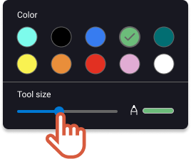
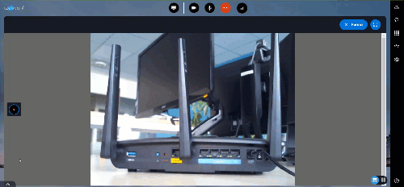


Drawing on a video can be **launched by the organizer** of the session only.


1. If you are an organizer, click on the interlocutor video. 

    |  | The video whiteboard opens. It displays on the interlocutor screen as well. |
    | --- | --- |
2. For more visibility, hide the videos at the bottom of the screen.
3. Draw on the video. All the participants can watch your annotations. They can participate and draw as well. 

    |  | The lines progressively disappear after a few seconds. |
    | --- | --- |

 
4. On the right, click the circle to change the color or the thickness of the line. 
 
  
5. When you are done, click **Close** on the top right of the whiteboard. 
 
 
