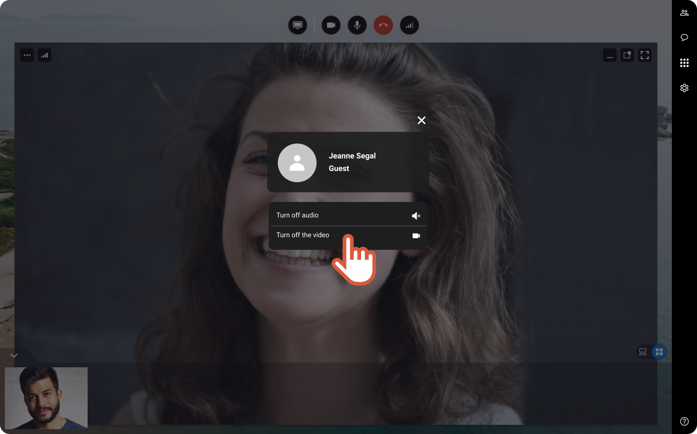


You are a guest participating to an ongoing session. 
Someone's video is bothering you and you want to hide it, but just for you.

1. On the top left of the participant video, click 

2. Click **Turn off video** to hide the participant video, just for you.

    

    You do not see anymore the participant. But the other participants still see that person.

    
3. Click the button again to activate the participant video.
