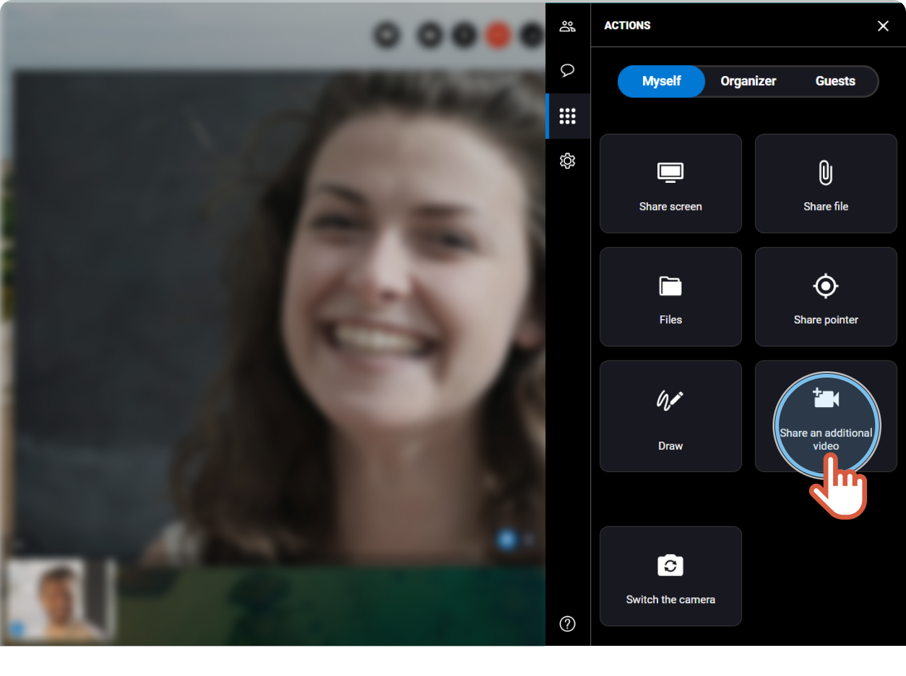


Available only if you have **several cameras** on your device.


You are participating in an ongoing session and you want to share another camera in addition to the one that is already used.


1. On the right, click the **Actions** tab 
2. If you are the organizer of the session, click the **Myself** tab.
3. Click **Share an additional video**. 
 
  

    

    A new video displays on the screen in addition to the one that was already displayed.

    