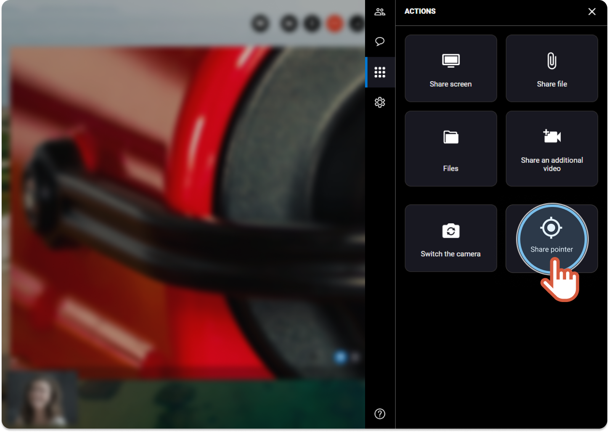
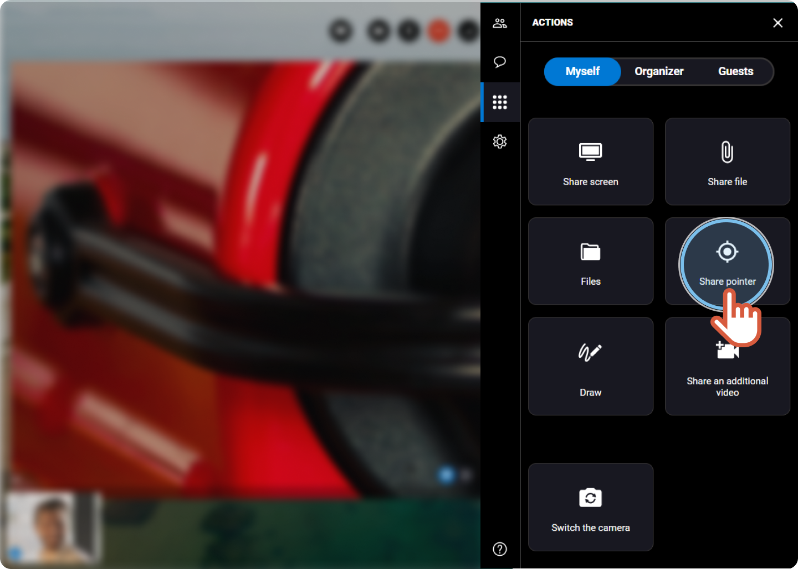


You are an organizer or a logged user and you want to point something relevant on the participant video.


1. On the right, click the **Actions** tab 
2. If you are the organizer of the session, click the **Myself** tab.
3. Click **Share pointer**.

    | Loggued user view |  |
    | --- | --- |
    | Organizer view |  |
4. Click on the interlocutor video to display the marks on the screen.

5. On the right hand side, unclick **Sharing pointer** again to deactivate it.
