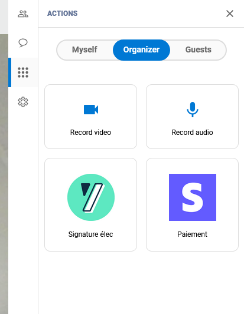


 - *A conference is running in Apizee Meet.* - *At least one custom action was configured.* - *You are the Organizer. You have refreshed the page.* 


1. On the right, click the **Actions** tab .
2. Go to the **Organizer** tab.
3. Find the custom action buttons. Each button shows its logo, label, and tooltip.

4. Click the button.
    * The link opens in a new tab.


*The new tab opens the configured URL. You stay in the conference.*

