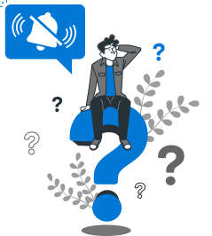
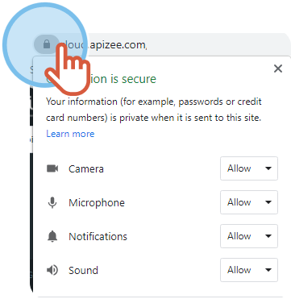


You are participating in an ongoing video session or 
You are logged in to your account and 
You do not hear the sound notifications


1. On the search bar of your browser, click the **padlock**.
2. In the drop-down menu, click **Allow** for **Camera**, **Microphone**, **Notifications** and **Sound**.

