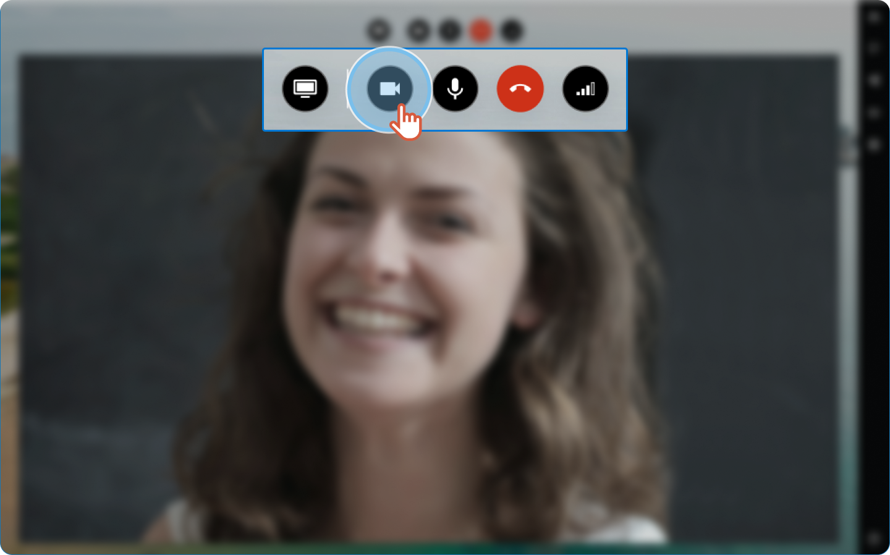

Please, check the following:


Your camera is available and it is connected.


The camera button is activated in the video conference tool.



You allowed the browser to use the camera:
1. Click **Allow** to use the microphone and the camera.

Your video displays and your microphone is on.


The camera settings are correctly set up
1. In the right-hand menu, click **Settings**.
2. Choose the camera you want to use.
3. Click **Apply**.

The page reloads with the new settings you chose.


The camera is not used by another application (Teams, Messenger, [CITRIX](https://apizee.atlassian.net/wiki/spaces/KBAS/pages/2224193539/R+aliser+une+visio-assistance+avec+la+solution+Apizee+et+Citrix),...)


You are using your mobile phone, the camera on the back of the phone is not activated.


The camera is correctly set up on your computer.


The settings of your computer allow the browser to access your camera.

Sometimes you need to go into your device settings to let your browser use the microphone and the camera.



**See also** [Allow the Web browser to access the camera and the microphone on my computer](allow-the-web-browser-to-access-the-camera-and-the-microphone-on-my-computer.md)




Still having an issue?

Contact the [Support](https://apizee.atlassian.net/servicedesk/customer/portals) team.

