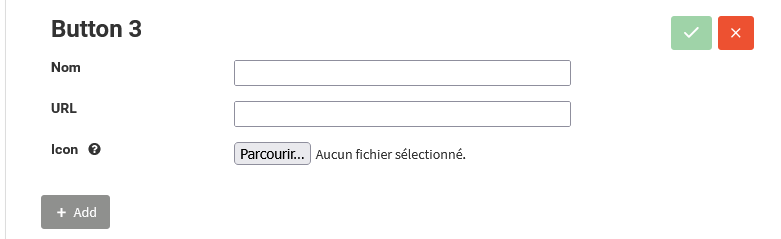
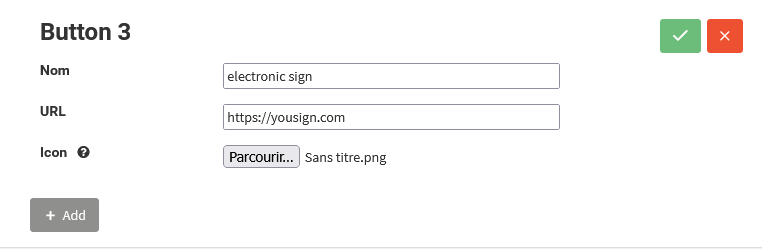
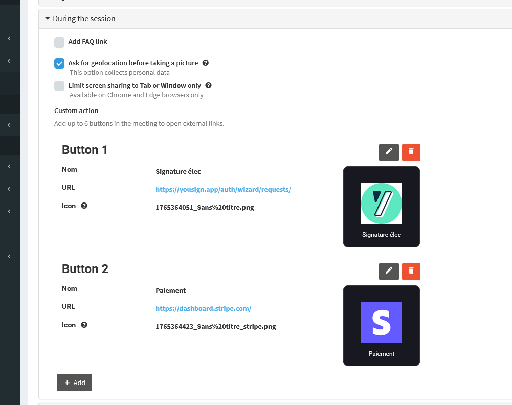

To improve workflow efficiency during video sessions, Apizee Meet lets administrators add custom buttons that give organizers instant access to external services like e-signature, payment, or support portals. These *Custom Action Buttons* appear directly inside the Organizer panel of Meet.

This article explains how to configure and manage these actions in the Cloud Portal.


 - *You are a Cloud Portal Administrator.* - *You have opened a **Meet-type service** configuration.* - *You can access: **Configuration → During the session → Custom action**.* 


1. Open the **service**you want to configure.
2. Select **Configuration**.
3. Scroll to **During the session** tab and click **Custom action**.
4. Click **Add**. A form opens.

5. In the **Name**field:
    * Enter a label (max. 20 characters).
    * Use only letters, numbers, and accents.
    * The name must be unique.
6. In the **URL**field:
    * Enter a link that starts with `http://` or `https://`.
    * The URL must be unique (max. 255 characters).
7. In the **Logo**field:
    * Click **Choose file** and upload a **PNG**, **JPG**, or **JPEG** file.
    * Minimum size: **32 × 32 px**. Maximum size: **500 KB**.

8. Click the **green check icon**to save the button.
    * The form becomes read-only.
    * A preview of the button appears.
    * You can add up to **6 buttons**.

9. To check the result:
    * Open a conference using the configured entry point.
    * As organizer, go to **Actions panel → Organizer** and verify the button appears.


*The custom action button appears in the Organizer panel during a video call session. It opens the link in a new browser tab.*

