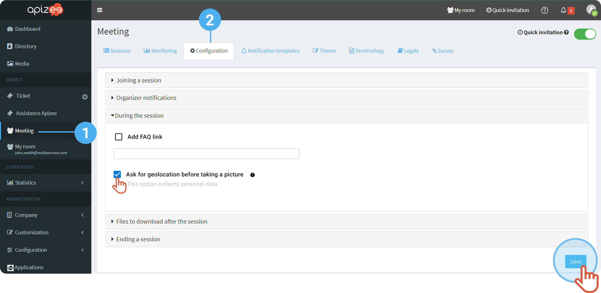
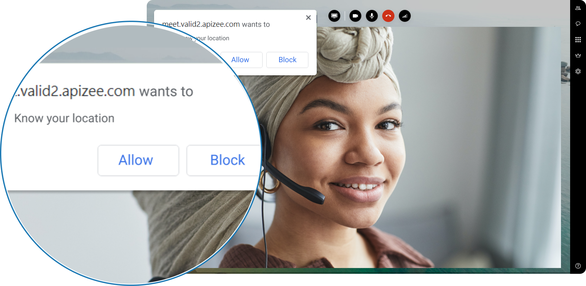
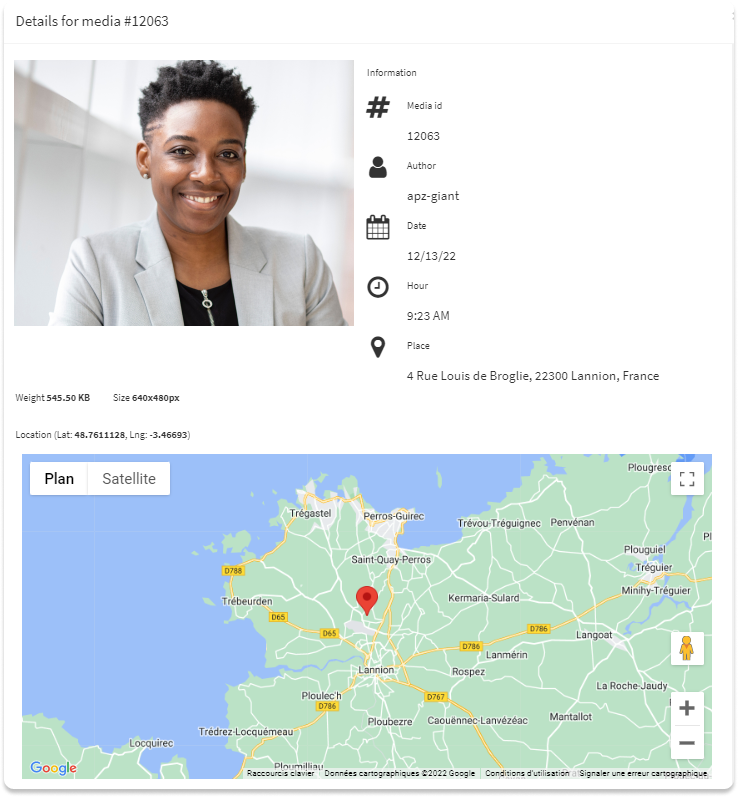

#  What happens when the geolocation is activated?

During a video conference, when the organizer clicks the button to take a picture of the participant video, a request displays on the participant screen and ask to share the geolocation. If the participant allows to share his geolocation, then the organizer can retrieve the participant location in the image information.

1. In the left-hand menu, click the service you want.
2. Click on the **Configuration**tab.
3. In the menu **During the session**, tick the box **Ask for geolocation before taking a picture**.
4. Click **Save**.


Now, a pop up will display on the guest screen to ask him to share his location when the orgnizer takes a picture.



If the guest **allows**, then the location information is available in the**shared files** of the session.




*See also** [Check the files information](../../follow-up-the-conferences-on-the-portal/check-the-files-information.md)

