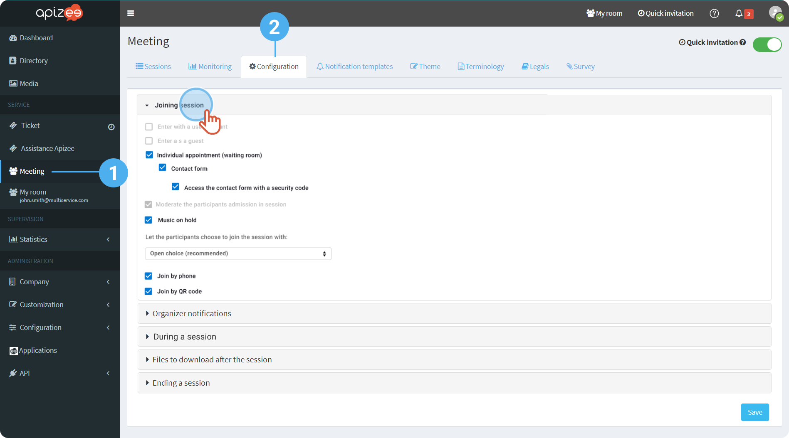

1. In the left-hand menu, click the service you want to configure.
2. Click the **Configuration** tab. 

3. Under **Joining a session**, tick the box to activate the option you want: 

    | **Enter with a user account** | Allow the user that have an account to log in to the session with its login and password. |
    | --- | --- |
    | **Enter as a guest** | Allow a guest to enter a session with a pseudonym or its real name. |
    | **Individual appointment** | Allow session with 2 persons only.
 
The guests wait for their turn in the waiting room.
 
This function automatically activates the **Moderation of the participants admission in session**. |
    | Contact form: 
 **Access the contact form with a security code** | The guest is asked to enter a security code received by message.
 
After confirming, the guest joins the session. |
    | **Moderate the participants admission** | Allows the organizer to control the participants entry in the session. The participants wait in a virtual waiting room before the organizer accepts or denies their participation in the session. |
    | **Peripherals selection when joining session** | Choose if the participants enter the session with the camera and the microphone activated or not. |
    | **Music on hold** | Activate or deactivate the music in the waiting room. |
    | **Join by phone** | Allow the guest to enter with a phone thanks to a phone number |
    | **Join by QR code** | Allow the guest to enter with a QR code |
