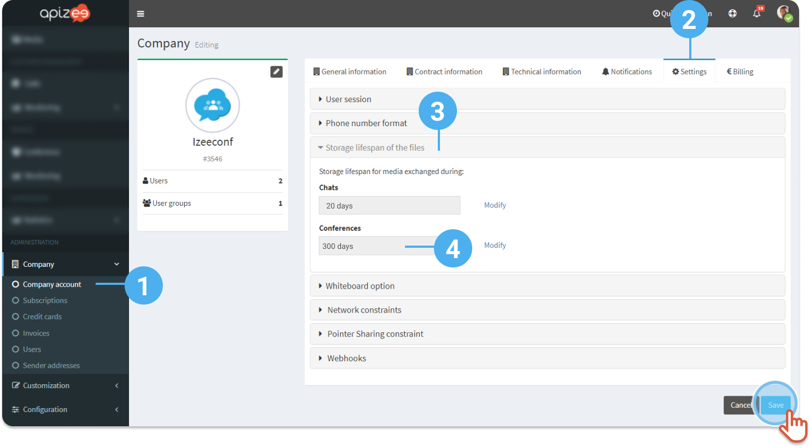


There is a place on the Apizee portal were all the files that were shared during the sessions are stored. 
 These files are available in the left-hand side menu, in the **Files**tab.


All the information (data, files,...) is stored for a certain amount of time before it is deleted. 
To configure the files lifespan:

1. In the left-hand menu click **Company** then, click **Company account**.
2. Click the **Settings** tab.
3. Under **Storage lifespan**, click **Modify** in front of the service for which you want to change the files lifespan.
4. Enter the number of days.
5. Click **Save**. 
 
 
