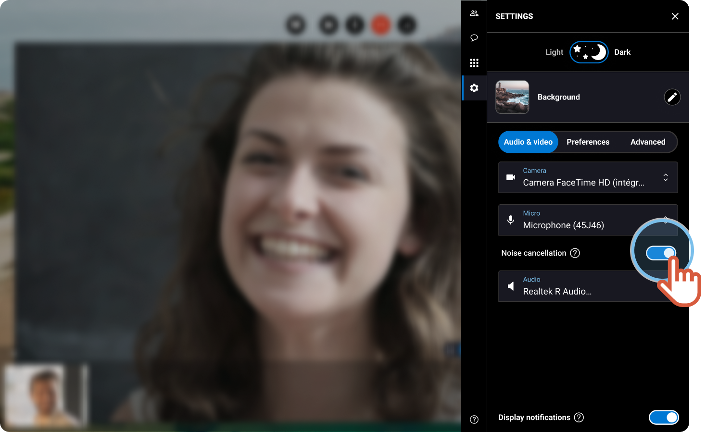

# How to activate the background Noise cancellation?

You are participating in an ongoing session but some unwanted noise **in your background** is disturbing the communication.

1. On the right, click the **Settings** tab.
2. Click **Audio & video**.
3. Switch the button in front of **Noise cancellation**.


As a result, you experience a reduced level of surrounding noise during the session.

