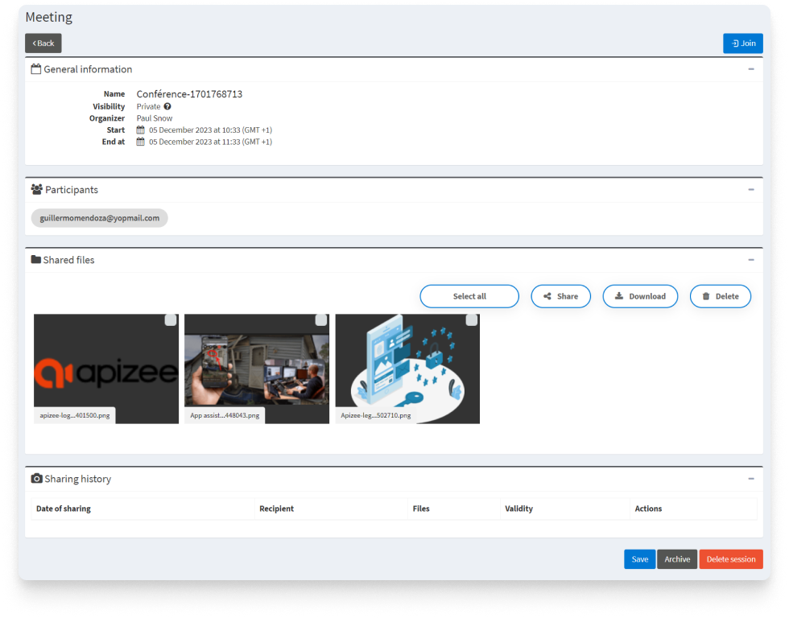


You are logged in to your account.


1. On the left-hand menu, click the service your want.
2. On the right, click **List**. 
That will help you find faster the session you are looking for.
3. In the list, find the session you want and click  
 
  

    

    The page displays with the following information:

    

##  General information

* date
* time
* organizer

## Participants

* mobile number or
* email address

## Shared files

* files shared during the session from both the organizer and participants
* recordings


**Did you know?**
 -  You can <a href="share-a-file.md" target="_blank">share again the files</a> to the participants event if the session is over.  - You can <a href="download-the-files-shared-during-the-conference.md" target="_blank">download the files</a> on your device.  


## Sharing history

* Which file
* Recipient
* Remaining time until the download link expires

##  Send a new invitation for the same session


The appointment time must not be exceeded.


1. Scroll down the page and click **Edit**.

For more information about sending a new invitation:



*See also** [Send a new invitation for the same session](send-new-invitation-for-same-session.md)

