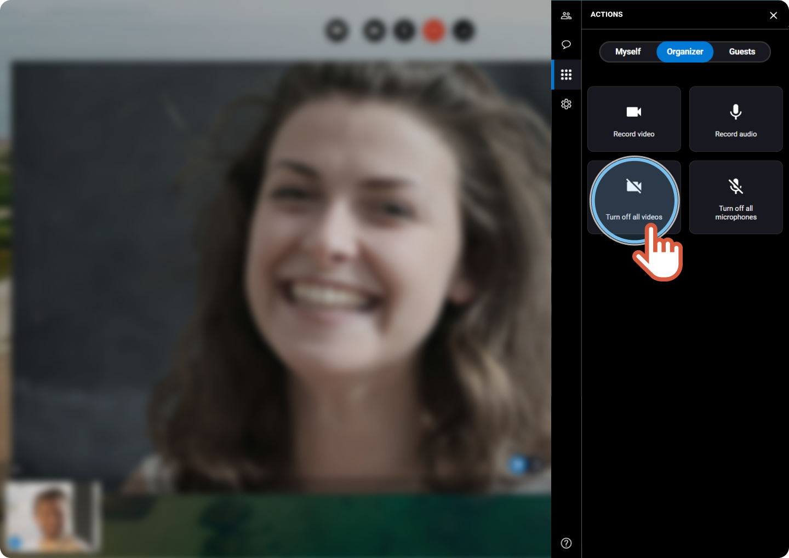

#  Deactivate the camera of all the participants


You are the organizer of the session and you want to turn off everyone's camera.


1. On the right, click the **Actions** tab 
2. Click the **Organizer** tab. 
 
 
3. If you want to cut all the participants cameras, click **Turn off all videos**. 
 
  

    |  | The camera of all the participants are turned off. The organizer is the only one that can be seen. |
    | --- | --- |
4. Click the button again to activate the all the cameras.
