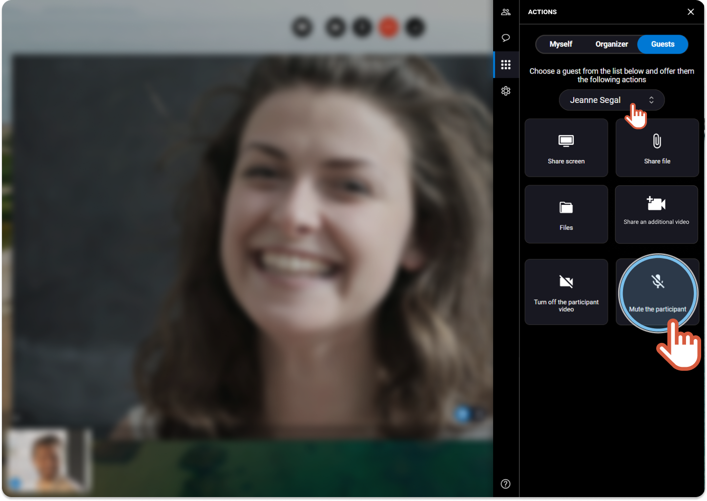


You are the organizer of the session and you want to mute a participant in particular.


1. On the right, click the **Actions** tab 
2. Click the **Guests** tab. 
 
 
3. If you are more than 2 participants, choose the name of the participant in the drop-down menu.
4. Click **Mute the participant**. 
 
  

    |  | The participant microphone is deactivated. Nobody can hear the participant. |
    | --- | --- |
5. Click the button again to unmute and activate the participant microphone.
