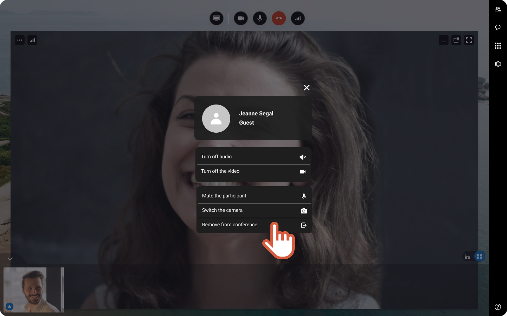


You are an organizer and for some reason, you need to kick a participant out of the session.


1. On the top left of the participant video, click  
 
 
2. At the bottom of the list, click **Remove from conference**. 
 
 


The participant is out. You can keep running the session with the other participants.

