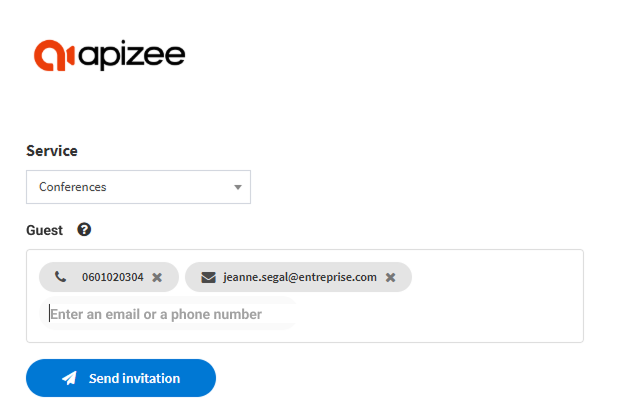

1. In the menu bar, at the top right, click **Quick invitation**. 

1. In the drop-down menu, choose the service (flow) with which you want to send the invitation.
2. Enter the participants email and/or phone numbers. 

3. Click **Send invitation**.


The invitation is sent. The participants will receive a message with a link to join the video session. 
The meeting page displays on the agent screen to directly join the meeting.

