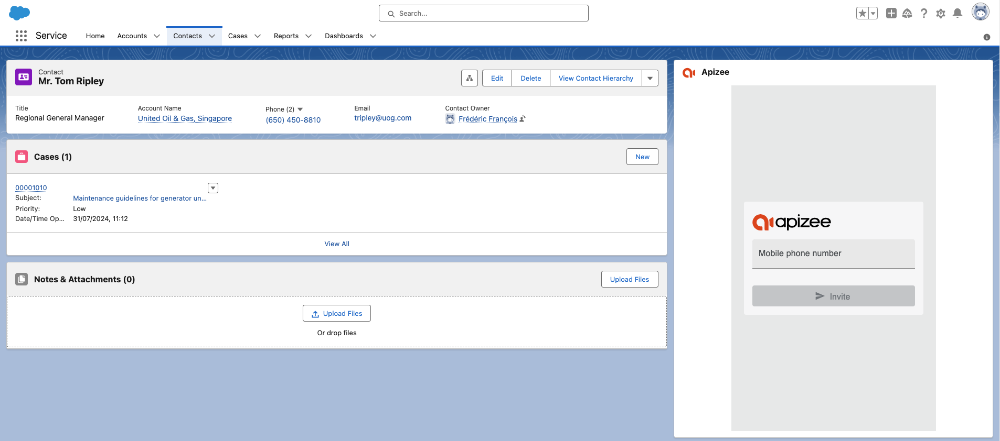

# Send an invitation to a video assistance

## From the Contact tab

1. In the list, click the name of the contact.

2. In Apizee widget, fill in the contact's mobile phone number.
3. Click **Invite**.


The invitation is sent by text message. The guest receives a link to join the video assistance.



If the contact already has a mobile phone number completed in their information, the phone number field will be automatically pre-filled.


## From Cases tab

1. In the list click the Case number.

2. In Apizee widget, fill in the contact's mobile phone number.
3. Click **Invite**.


The invitation is sent by text message. The guest receives a link to join the video assistance.



If the contact already has a mobile phone number completed in their information, the phone number field will be automatically pre-filled.

