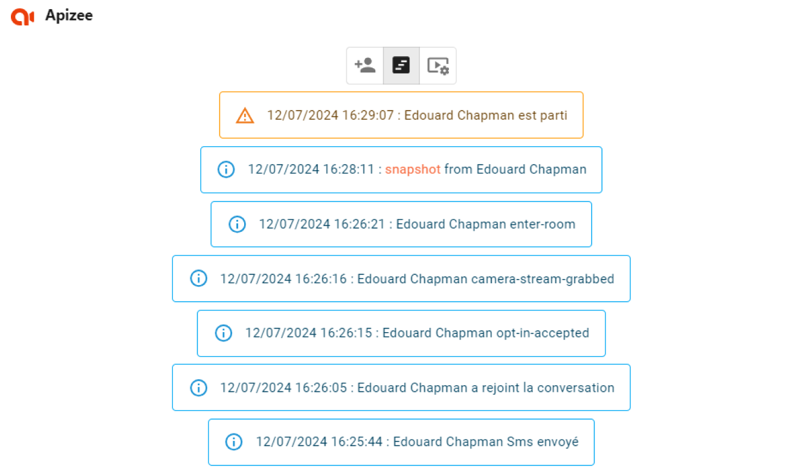

# Follow and guide the guest


You are an agent and you need to:
- understand&#160;**in which step the guest&#160;****is&#160;**to join the video assistance- **retrieve some events**&#160;of the video assistance- have a&#160;**quick sum up**&#160;of what happened during the video assistance


1. In the **Apizee**section, on the upper side, click the **Évènements**button 
2. Check the events that are displaying.

| Event | Explanation |
| --- | --- |
| Sms envoyé | The text message was sent. |
| Sms send failure | The text message could not be sent. |
| a rejoint la conversation | The guest clicked the link in the invitation. |
| opt-in accepted | The guest agreed to the legal terms. |
| camera stream grabbed | The guest allowed the web browser to use the camera. |
| enter room | The video assistance started. |
| snapshot from | The agent took a picture of the guest video. |
| est parti | The guest left the session. |
