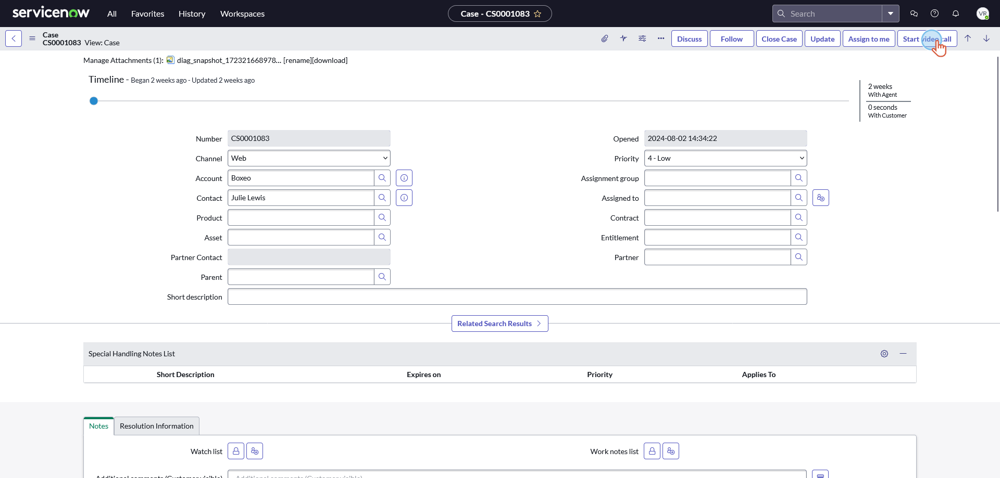
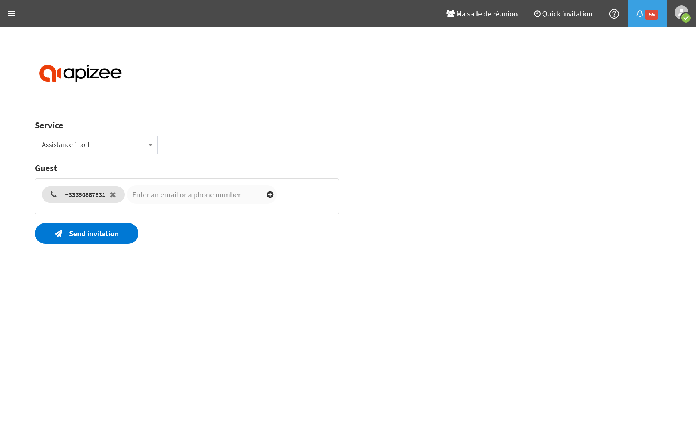

# Start a new video call


* The Apizee Visual Support app has been installed and activated on your ServiceNow instance by an administrator.
 * You use the CSM or ITSM Workspace (**classicUI**)


#  

1. Click on the "Start video call" button in the Action UI menu bar at the top right corner of the page.

    

    A pop up blocker from your web browser may prevent ServiceNow to open a new tab. If no new tabs opens, please check if there is any information notice displayed by your browser requiring your attention to unblock new tabs opening.

    
2. If you are not already logged in into the Apizee solution, fill in your username and password then click on the Sign-In button.

    

    The SSO authentication option is compatible with the Apizee for ServiceNow app.

    
3. You are now ready to send an invitation to join the video call to your guest.
Check the phone number that has been pre-filled from ServiceNow's Contact phone number and click on the "Send Invitation" button.

    

    The invitation is sent through text message (SMS). You need to input a valide mobile phone number.

    
    
4. In the Apizee solution, you will be automatically redirected to the detail page of the newly created **ticket**.
Eventually the Guest clicks on the link they received via SMS and starts the video call.
    

    

    You will then be prompted with a call signal.

    