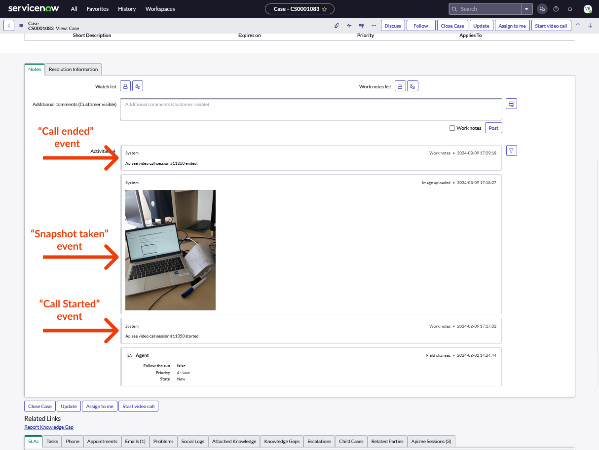

# "Call started" and "call ended" events in the activity feed of a Case or Incident


* The Apizee Visual Support app is installed and activated on your ServiceNow instance.
 * You use the CSM or ITSM Workspace (**classicUI**)


# 

When a Fulfiller [starts a new video call](https://doc.apizee.com/smart/apizee-for-servicenow/modernui-getting-started-servicenow), the start date and time of the call automatically appear in the Case's or Incident's activity feed. Similarly, when the Guest or the Agent hangs up, a timestamped 'call ended' event is inserted into the Case's or Incident's activity feed.


The activity feed is to be found in the "Notes" tab in the Case or Incident's detail page.


# Snapshot automatically attached to the Case or Incident

The Apizee solution allows Fullfillers to capture snapshots from the guest's front or rear camera stream. Each time a snapshot is taken, it is automatically uploaded to the Case or Incident attachments, and a new event appears in the Case or Incident's activity feed.

##
