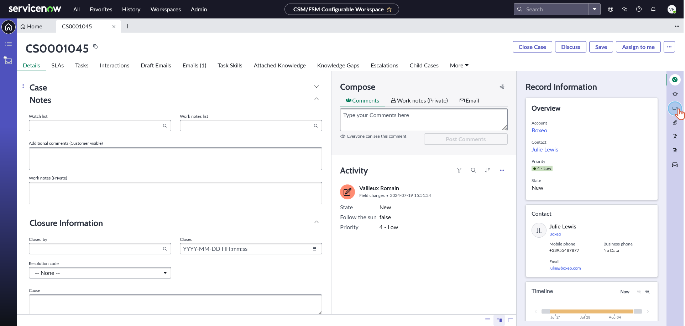
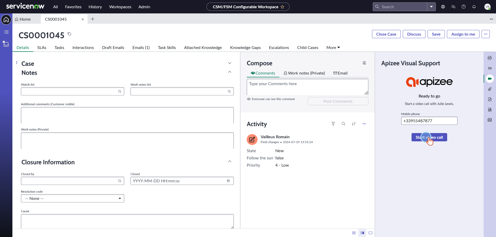
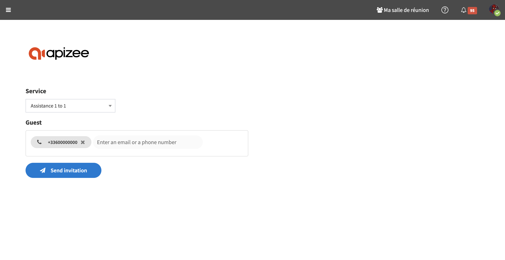

# Getting started with Apizee for ServiceNow

The Apizee connector is an add-on for ServiceNow. It helps customer support personnel start video sessions inside ServiceNow.


*Use this connector to give visual help to the user during support calls.*

**Target Users:** Support agents who use ServiceNow.
**Main Benefit:** When phone, email, or chat is not enough, video helps solve problems faster.
**Benefits:** Faster resolution, reduced escalation and enhanced tracking.


## Quick Start Guide


Before you start, make sure:

* The Apizee connector is installed.
* You can access ServiceNow with a user account authorized to use Apizee.
* Your Internet connection is stable.
* Your device has camera and microphone access enabled.


1. **Log in to ServiceNow.**

   Enter your credentials and access the platform.

2. **Check Apizee connector availability.**

   Search "Apizee" in the navigation panel. If it does not appear, contact your administrator.

   

   
   Make sure the Apizee icon is visible in the sidebar.
   

3. **Start the video session.**

   Open the incident or customer's record. Click **Start Video Call**.

   

   
   Note that the phone number field is pre-filled with the Contact's mobile phone number associated with the current Case or Incident.

   To send an invitation for a video call to a different number, please update the phone number in the side panel or later in the Apizee platform.
   

4. **Log in to the Apizee solution.**

   If you are not already logged in the Apizee solution, fill in your user name and password then click **Sign-In**.

   

   
   The SSO authentication option is compatible with the Apizee for ServiceNow app.
   

5. **Send invitation.**

   You are now ready to send an invitation to join the video call to your guest: click **Send Invitation**.

   

6. **Allow access to camera and microphone.**

   Accept the prompt in your browser.

   
   *If no prompt appears, check your browser's settings.*
   

7. **The video call begins.**

   In the Apizee solution, you will be automatically redirected to the detail page of the newly created **ticket**.

   Eventually, the guest will click on the link they received via SMS and begin the video call.

   You will then be prompted with a call signal.

   

8. **Assist the user.**

   Discover all the available visual engagement actions accessible through your ServiceNow platform in the dedicated article:

   ➡️ [Visual engagement actions overview](https://apizeelegacy.gitbook.io/apizeelegacy-docs/video-assistance/help-desk/actions-during-the-video-assistance/actions-overview)

## FAQ and Troubleshooting

**Q1: What if I do not receive the call signal?**

* Ensure that you are logged in with an account that has the necessary permissions.
* Refresh the page and verify your Internet connection.
* If the issue persists, contact your administrator.

**Q2: My browser is not prompting for camera/microphone access. What should I do?**

* Check your browser's security settings to ensure access is allowed for the Apizee site.
* Restart your browser and try again.

**Q3: What if the audio or video quality is poor?**

* Confirm that you are on a stable network.
* Close background applications that may be using bandwidth.
* For prolonged issues, contact technical support.

## Tips

* For improved session quality, close unnecessary background applications that could consume network resources or CPU power.
* Use a quiet, well-lit environment for optimal video quality during calls with clients.
