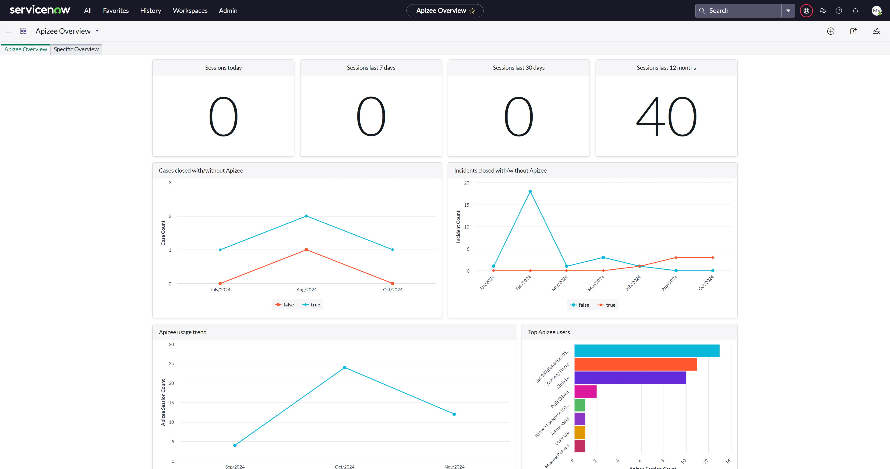

#  Access to the Apizee video call dashboard

1. Click on "All" in the top left menu in your ServiceNow.
2. Search for "Apizee"
3. In the results, click on the "Usage overview" menu item.


You now see the dashboard installed by default with the Apizee app.

