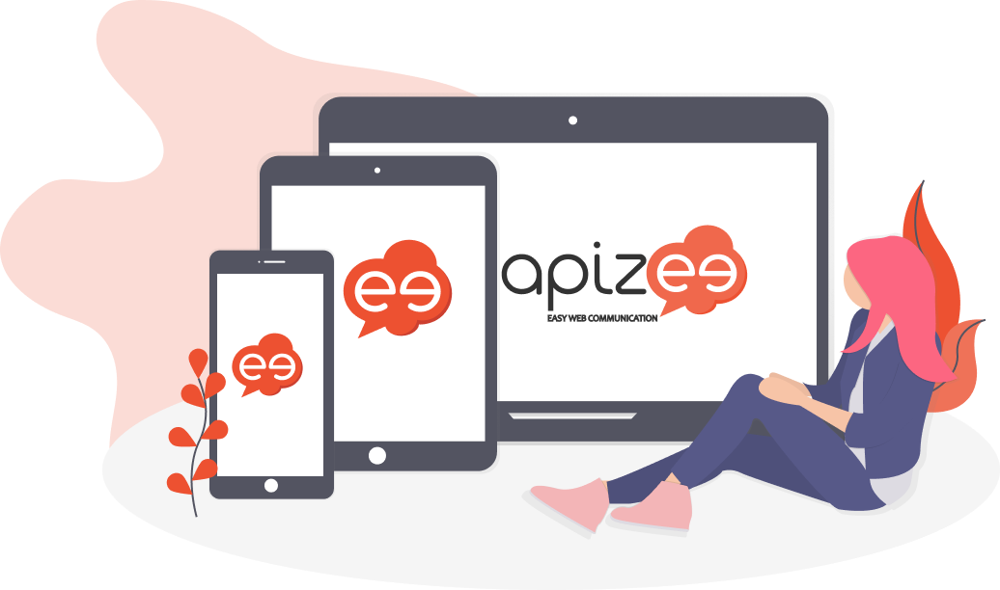

# Choose your user guide

**Are you?**

* Admin
* User
* Guest

Choose a user guide according to your profile and check the information relevant to your user role only.

# Check the compatibility

Apizee solutions are "Plug-in free".
They are 100% Web-based to ensure communication experience on major Internet browsers and connected devices.

Video communication has never been that easy!


**No installation needed**

The Apizee solutions use the **ApiRTC** architecture which uses the **WebRTC** protocol.
This protocol of communication is directly embedded in the latest versions of the Web browsers.
This is why you do not need to install anything as long as you have a compatible Web browser.




**Compatible devices**

The Apizee solutions are compatible with:

* PC
* macOS
* Tablets
* Smartphones



## System configuration

| OS | Version | Characteristics |
| :--- | :--- | :--- |
| Windows | 7, 8, 10 & 11 | Intel Core 2 Duo 4GB RAM  
Recommended: I5 quad-core 8GB RAM |
| macOS | From 10.7 to 10.13 | All, since 2011 |
| iOS | 8 + | iPhone 5, iPad 1 |
| Android | 4.4 + | ARM or x86 Dual-core 3GB RAM  
Recommended: octo-core 6GB RAM |
| Bandwidth | -- | 300kb/s – 2.4MB/s  
Recommended: 4G |
| Camera | -- | All  
Recommended: 720p/1080p |

## Compatible Web browsers

We recommend that you use the following Web browsers for a better experience with our solutions:

| Chrome | Firefox | Opera | Edge | Safari | Samsung Internet |
| :---: | :---: | :---: | :---: | :---: | :---: |
|  |  |  |  |  |  |

### Windows

| Feature | Chrome | Firefox | Opera | Edge | Safari | Samsung |
| :--- | :--- | :--- | :--- | :--- | :--- | :--- |
| Audio/video | v45+ | v46+ | v35+ | v79+ |  |  |
| Whiteboard | ✓ | ✓ | ✓ | ✓ |  |  |
| Screensharing | ✓\* | v52+ | ✓ | ✓ |  |  |
| Conference | ✓ | ✓ | ✓ | ✓ |  |  |
| Remote access (Windows 7, 8.1, 10 & 11) | ✓ | ✓ | N/A Win 8.1 |  |  |  |

### macOS

| Feature | Chrome | Firefox | Opera | Edge | Safari | Samsung |
| :--- | :--- | :--- | :--- | :--- | :--- | :--- |
| Audio/video | v45+ | v46+ | v35+ | v79+ | v11+ † |  |
| Whiteboard | ✓ | ✓ | ✓ | ✓ | ✓ |  |
| Screensharing | ✓\* | v52+ | ✓ | ✓ | v13.0.2+ |  |
| Conference | ✓ | ✓ | ✓ | ✓ | ✓ |  |

### iOS

| Feature | Chrome | Firefox | Opera | Edge | Safari | Samsung |
| :--- | :--- | :--- | :--- | :--- | :--- | :--- |
| Audio/video | -- | -- | -- | -- | iOS 11.2+ † |  |
| Whiteboard | ✓ | ✓ | ✓ | ✓ | ✓ |  |
| Screensharing | -- | -- | -- | -- | View ‡ |  |
| Conference | -- | -- | -- | -- | ✓ |  |

### Android

| Feature | Chrome | Firefox | Opera | Edge | Safari | Samsung |
| :--- | :--- | :--- | :--- | :--- | :--- | :--- |
| Audio/video | v59+ | v54+ | v40+ | v79+ |  | Tested with v7.2.10.33+ |
| Whiteboard | ✓ | ✓ | ✓ | ✓ |  | ✓ |
| Screensharing | View ‡ | View ‡ | View ‡ | View ‡ |  | View ‡ |
| Conference | ✓ | ✓ | ✓ | ✓ |  | ✓ |

### Linux

| Feature | Chrome | Firefox | Opera | Edge | Safari | Samsung |
| :--- | :--- | :--- | :--- | :--- | :--- | :--- |
| Audio/video | v45+ | v46+ | v35+ |  |  |  |
| Whiteboard | ✓ | ✓ | ✓ |  |  |  |
| Screensharing | ✓\* | v52+ | ✓ |  |  |  |
| Conference | ✓ | ✓ | ✓ |  |  |  |

---

\* Screen sharing available with browser extension.

† Safari 14.0.1 on macOS and 14.2 on iOS have sound issues.

‡ The user can see the screen shared by the other participants but cannot share their own screen.
