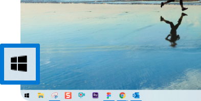
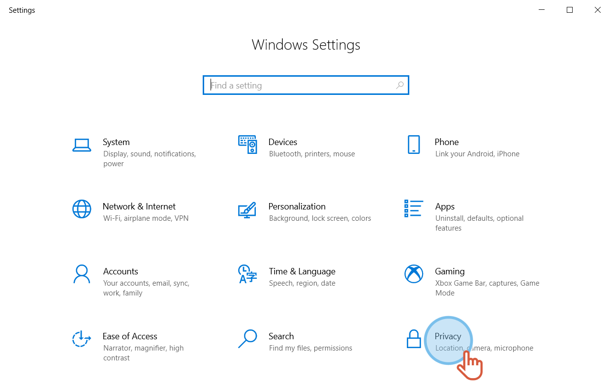
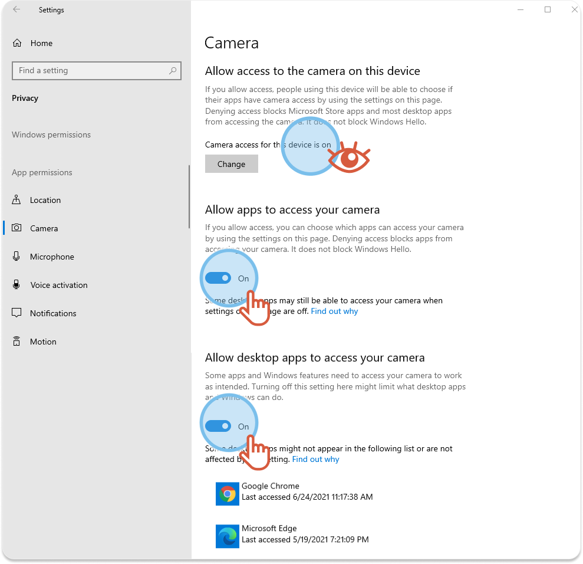
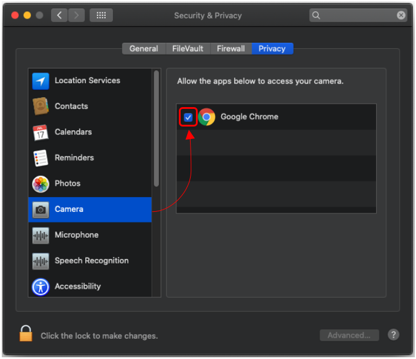


You want to participate to a video session and you cannot activate the camera, the microphone or share the screen.


Check if the settings of your computer allow the Web browser to access the peripherals (camera, microphone, etc.)

# On Windows

1. From the computer desktop, click **Start**.

2. Click **Settings**.
3. Click **Privacy**.

## Allow the Web browser to access the camera

* * *

1. On the left-hand menu, click **Camera**.
2. Check the **Camera access for this device** is **on**.
3. Under, **Allow apps to access your camera**, click **On**.
4. Under, **Allow desktop apps to access your camera**, click **On**.

## Allow the Web browser to access the microphone

* * *

Follow the same procedure as above but for the microphone.

1. On the left-hand menu, click **Microphone**.
2. Check the **Microphone access for this device** is **on**.
3. Under, **Allow apps to access your microphone**, click **On**.
4. Under, **Allow desktop apps to access your microphone**, click **On**.


Go back to the video session and activate the camera, microphone or screen-sharing.


# On MacOs

1. From the computer desktop, click 
2. On the left-hand menu, click **camera** and check that your Web browser is ticked.

3. On the left-hand menu, click **microphone** and check that your Web browser is ticked.
4. On the left-hand menu, click **Screen Recording** and check that your Web browser is ticked.


Go back to the video session and activate the camera, microphone or screen-sharing.

