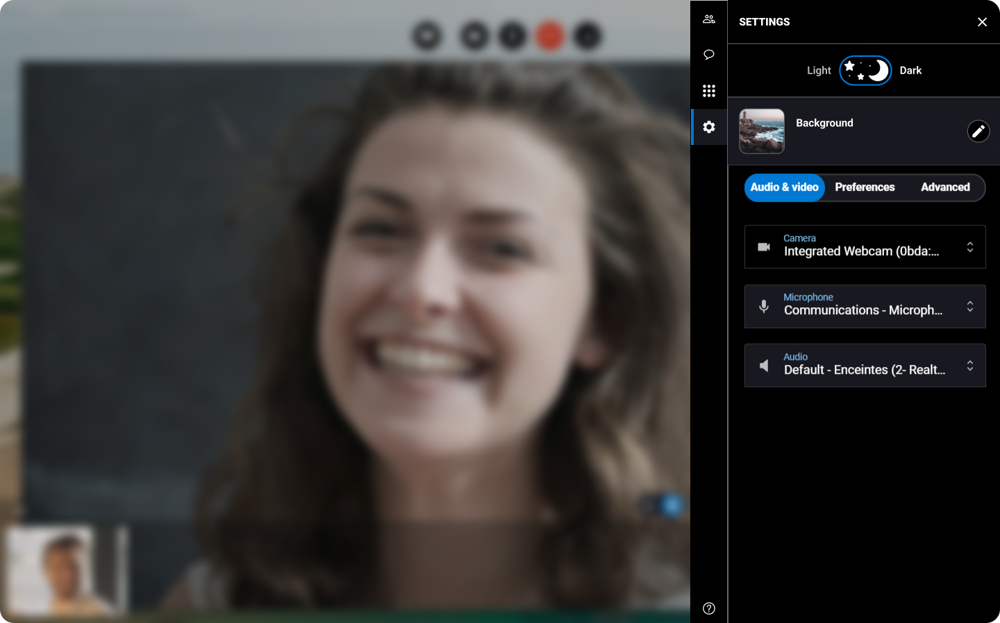


You are about to start a session or you are already in an ongoing session and you need to configure your peripherals.


1. On the right, click the **Settings** tab.
2. Click **Audio & video**.
3. Choose in the drop-down menus the **camera**, the **microphone** and **audio** item you want to use for the session.


The session reloads with the new settings you applied.

