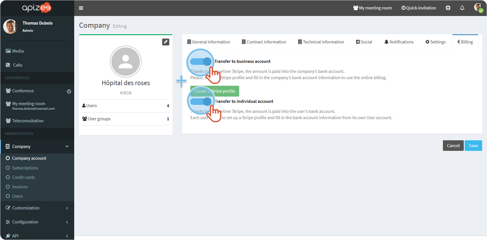
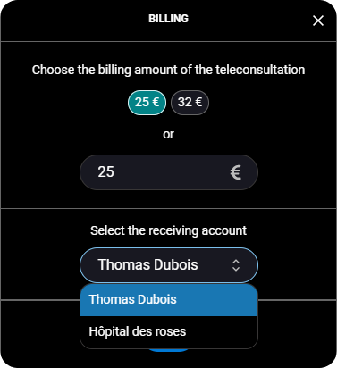


You are an administrator & you are logged in to your account.


If a practitioner works for both a structure and his/her own account, you can activate the **business** and the **individual** billing.

1. [Activate](README.md) **Transfer to business account** and **Transfer to individual account**[.](activate-the-billing-feature.md) 
 
 
2. Configure the [business billing](configure-the-business-billing.md).
3. Tell the practitioner to configure the [individual billing](configure-the-individual-billing.md) on his/her user account. 

    

    The practitioner will be able to choose the recipient account during the online billing.

    
 
