
You are an administrator and you are logged in to your account


#  Creating a Stripe profile for the company


Stripe is a securized payment platform. 
 Stripe needs information to ensure the transfers between the patient account and the business account.


1. On the left-hand menu, click **Company** then, **Company account**.
2. Click on the **Billing** tab.
3. Activate **Transfer to the business account**.
4. Click **Create a Stripe profile**. 
 
 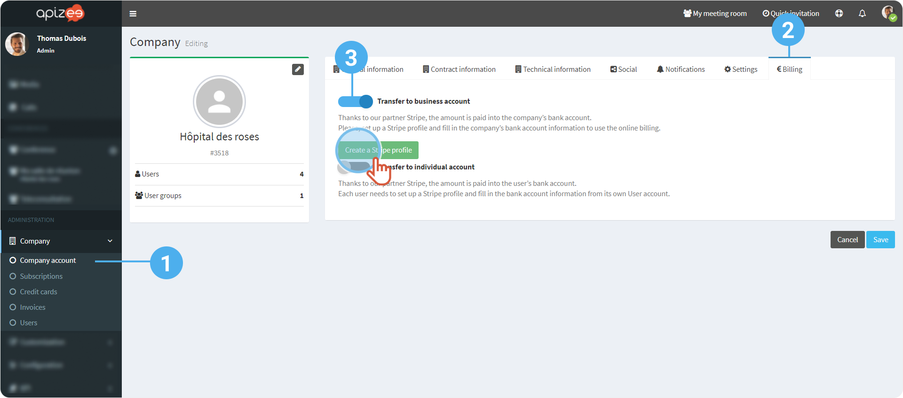 

    

    You are being directed to **Stripe** Website.

    
##  Business details

* * *

1. Fill in the information about the company or the structure.
2. If you do not have a Website, click **Add a product description instead**.
3. Enter the medical specialty (activity) + the indication “Teleconsultation”.
4. Click **Next**. 
 
 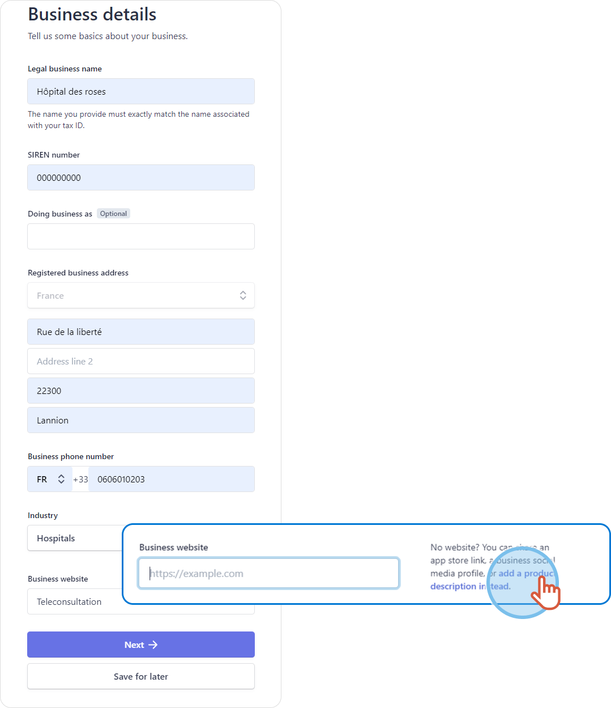

## Business representative

* * *

1. Enter the information about the business representative.
2. Click **Next**. 
 
 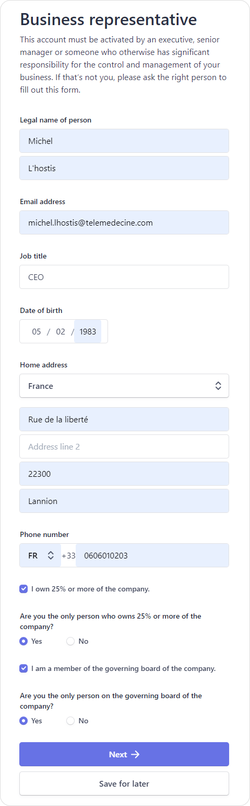 

    

    The information is being verified.

    
 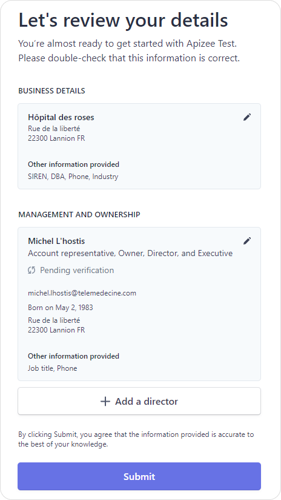

Stripe can randomly ask for more information to verify the identity of the business representative.

[+] [Show More](javascript:void%280%29)
 [-] [Hide](javascript:void%280%29)
 ## Additional information 
 
* * *

1. Click **Update**. 
 
 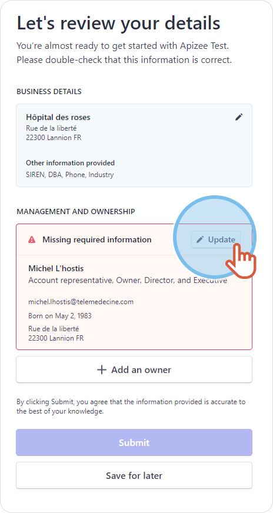
2. Under **ID verification**, click **Verify now**. 
 
 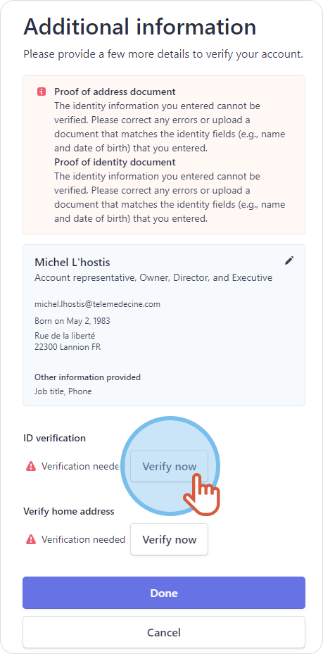
3. Upload an identity document and click **Complete**. 
 
 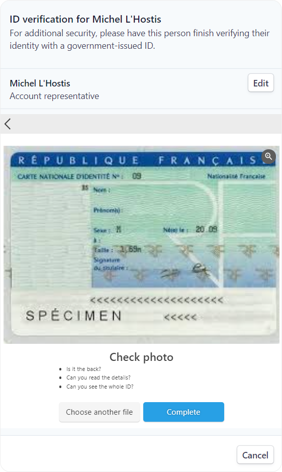
4. Under **Verify home address**, click **Verify now**.
5. Upload a proof of address document and click **Continue to upload**. 
 
 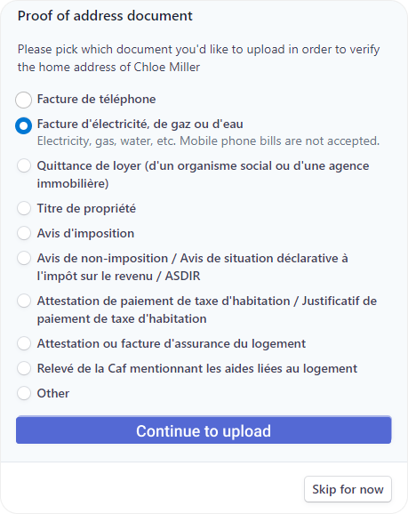
6. Tick the required boxes.
7. Click **Submit documents**. 
 
 
8. Click **Done** then, **Submit**. 
 
 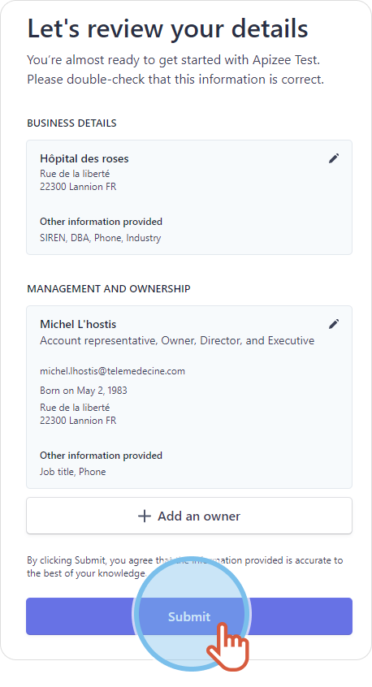

# Adding a bank account


You configured a Stripe profile for the company.  
 You are logged in to your account, on the **Company** page &gt; **Company account**, on the **Billing tab**.


1. Click **Add new bank account**. 
 
 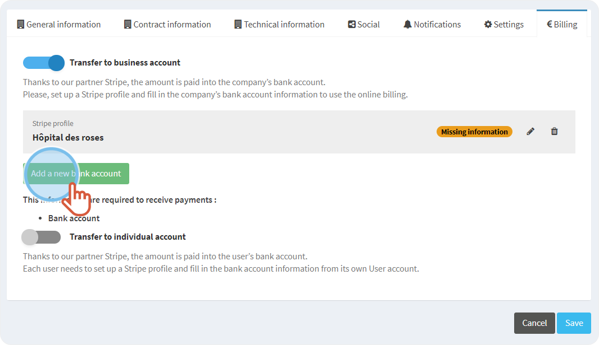
2. Enter the **holder name** of the bank account.
3. Enter the **international IBAN number** of the bank account.
4. Click **Continue**. 
 
 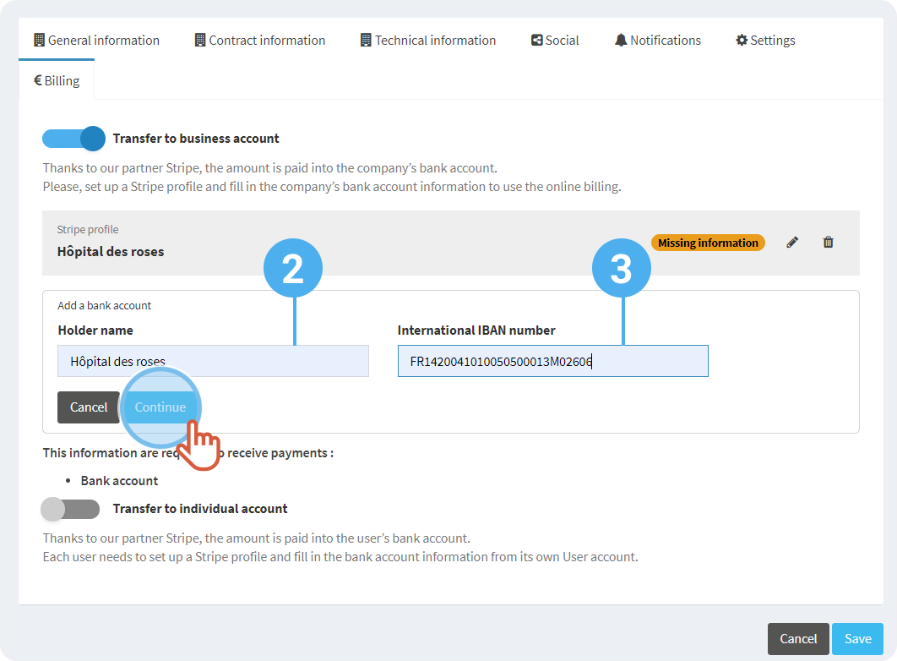
5. Click **Save**.

* * *
 **Watch the tutorial**

[More tutorials](../../tutorials-health.md)
