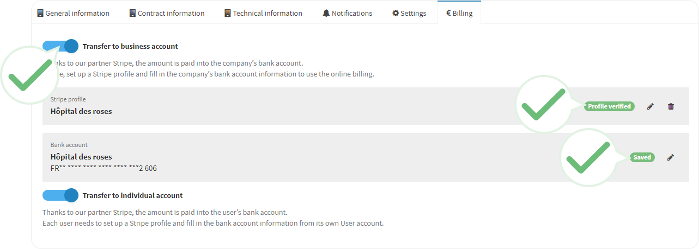

Please check the following:


The **Bill** button displays next to the patient name. | 


You activated the online billing on the portal. | 


You completed the **Stripe** profile (securized payment platform) and your information is up to date.


You provided your bank information on your user account.


Still having an issue?

Please, contact the [Support Team](https://apizee.atlassian.net/servicedesk/customer/portals). |




**See also** [Activate the online billing](../configuration-on-the-apizee-portal/activate-the-online-billing/README.md).

